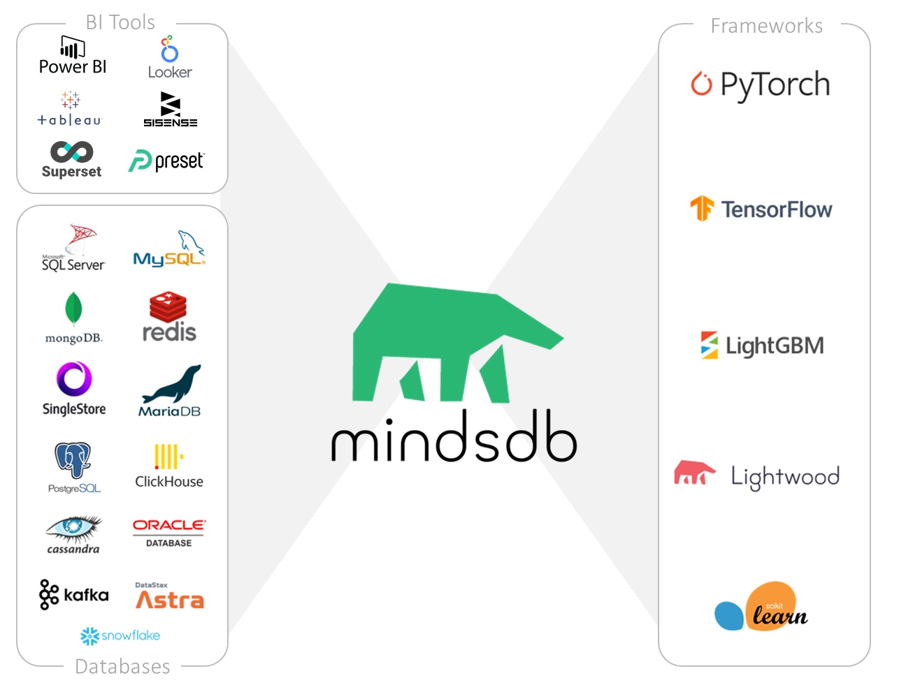

<h1 align="center">
	
	<br>

</h1>
<div align="center">

<a
     href="https://runacap.com/ross-index/annual-2022/"
     target="_blank"
     rel="noopener"
/>
    
</a>

<br>
	<a href="https://github.com/mindsdb/mindsdb/actions"></a>

  <a href="https://www.python.org/downloads/" target="_blank"></a>
   <a href="https://pypi.org/project/MindsDB/" target="_blank"></a>
  <a href="https://hub.docker.com/u/mindsdb" target="_blank"></a>
  <a href="https://www.mindsdb.com/"></a>	
    <a href="https://join.slack.com/t/mindsdbcommunity/shared_invite/zt-o8mrmx3l-5ai~5H66s6wlxFfBMVI6wQ" target="_blank"></a>
	</br>
	<a href="https://deepnote.com/project/Machine-Learning-With-SQL-8GDF7bc7SzKlhBLorqoIcw/%2Fmindsdb_demo.ipynb" target="_blank"></a>
	</br>
	
  <h3 align="center">
    <a href="https://www.mindsdb.com?utm_medium=community&utm_source=github&utm_campaign=mindsdb%20repo">Website</a>
    <span> | </span>
    <a href="https://docs.mindsdb.com?utm_medium=community&utm_source=github&utm_campaign=mindsdb%20repo">Docs</a>
    <span> | </span>
    <a href="https://join.slack.com/t/mindsdbcommunity/shared_invite/zt-o8mrmx3l-5ai~5H66s6wlxFfBMVI6wQ">Community Slack</a>
    <span> | </span>
    <a href="https://github.com/mindsdb/mindsdb/projects">Contribute</a>
    <span> | </span>
    <a href="https://cloud.mindsdb.com">Demo</a>
    <span> | </span>
    <a href="https://mindsdb.com/in-database-nlp-tutorials-contest?utm_medium=community&utm_source=github&utm_campaign=22q4-huggingface-preview">NLP Contest</a>
  </h3>
  
</div>

----------------------------------------

[MindsDB](https://mindsdb.com?utm_medium=community&utm_source=github&utm_campaign=mindsdb%20repo)  ML-SQL Server enables machine learning workflows for the most powerful databases and data warehouses using SQL.  [](https://twitter.com/intent/tweet?text=Machine%20Learning%20inside%20Databases%20&url=https://www.mindsdb.com&via=mindsdb&hashtags=ai,ml,machine_learning,neural_networks,databases,sql)
* Developers can quickly add AI capabilities to your applications.
* Data Scientists can streamline MLOps by deploying ML models as AI Tables.
* Data Analysts can easily make forecasts on complex data (like multivariate time-series with high cardinality) and visualize them in BI tools like Tableau.

**NEW!** Check-out the [rewards and community programs.](https://mindsdb.com/community?utm_medium=community&utm_source=github&utm_campaign=mindsdb%20repo)

----------------------------------------

[Installation](https://github.com/mindsdb/mindsdb#installation) - [Overview](https://github.com/mindsdb/mindsdb#overview) - [Features](https://github.com/mindsdb/mindsdb#features) - [Database Integrations](https://github.com/mindsdb/mindsdb#database-integrations) - [Quickstart](https://github.com/mindsdb/mindsdb#quickstart) - [Documentation](https://github.com/mindsdb/mindsdb#documentation) - [Support](https://github.com/mindsdb/mindsdb#support) - [Contributing](https://github.com/mindsdb/mindsdb#contributing) - [Mailing lists](https://github.com/mindsdb/mindsdb#mailing-lists) - [License](https://github.com/mindsdb/mindsdb#license)

----------------------------

<h2 align="center">
   Machine Learning using SQL 
   <br/>
   <br/>
  	

</h2>


## Demo

You can try the Mindsdb ML SQL server here [(demo)](https://cloud.mindsdb.com).

## Installation

To install the latest version of MindsDB please pull the following Docker image:

```
docker pull mindsdb/mindsdb
```

Or, use PyPI:

```
pip install mindsdb
```

## Overview

MindsDB automates and abstracts machine learning models through virtual AI Tables:

Apart from abstracting ML models as AI Tables inside databases, MindsDB has a set of unique capabilities:

* Easily make predictions over very complex multivariate time-series data with high cardinality

* An open JSON-AI syntax to tune ML models and optimize ML pipelines in a declarative way


#### How it works:

1. Let MindsDB connect to your database.

2. Train a Predictor using a single SQL statement (make MindsDB learn from historical data automatically) or import your ML model to a Predictor via JSON-AI. 

3. Make predictions with SQL statements (Predictor is exposed as virtual AI Tables). There’s no need to deploy models since they are already part of the data layer.

Check our [docs](https://docs.mindsdb.com/?utm_medium=community&utm_source=github&utm_campaign=mindsdb%20repo) and [blog](https://mindsdb.com/blog/?utm_medium=community&utm_source=github&utm_campaign=mindsdb%20repo) for tutorials and use case examples.


## Features

* Automatic data pre-processing, feature engineering, and encoding
* Classification, regression, time-series tasks
* Bring models to production without “traditional deployment” as AI Tables
* Get models’ accuracy scoring and confidence intervals for each prediction
* Join ML models with existing data
* Anomaly detection
* Model explainability analysis 
* GPU support for models’ training
* Open JSON-AI syntax to build models and bring your ML blocks in a declarative way 


## Database Integrations

MindsDB works with most of the SQL and NoSQL databases and data Streams for real-time ML.

| Connect your Data | Connect your Data | Connect your Data
|-|-|-|
| <a href="https://docs.mindsdb.com/"></a> | <a href="https://docs.mindsdb.com/"></a> | <a href="https://docs.mindsdb.com/"></a> |
| <a href="https://docs.mindsdb.com/"></a> | <a href="https://docs.mindsdb.com/"></a> | <a href="https://docs.mindsdb.com/"></a> |
| <a href="https://docs.mindsdb.com/"></a> | <a href="https://docs.mindsdb.com/"></a> | <a href="https://docs.mindsdb.com/"></a> |
| <a href="https://docs.mindsdb.com/"></a> | <a href="https://docs.mindsdb.com/"></a> | <a href="https://docs.mindsdb.com/"></a> |
| <a href="https://docs.mindsdb.com/"></a> | <a href="https://docs.mindsdb.com/"></a> | <a href="https://docs.mindsdb.com/"></a> |
| <a href="https://docs.mindsdb.com/"></a> | <a href="https://docs.mindsdb.com/"></a> | <a href="https://docs.mindsdb.com/"></a> |
| <a href="https://docs.mindsdb.com/"></a> | <a href="https://docs.mindsdb.com/"></a> | <a href="https://docs.mindsdb.com/"></a> |
| <a href="https://docs.mindsdb.com/"></a> | <a href="https://docs.mindsdb.com/"></a> | <a href="https://docs.mindsdb.com/"></a> | 
| <a href="https://docs.mindsdb.com/"></a> | <a href="https://docs.mindsdb.com/"></a> | <a href="https://docs.mindsdb.com/"></a> 
| <a href="https://docs.mindsdb.com/"></a> | <a href="https://docs.mindsdb.com/"></a> | <a href="https://docs.mindsdb.com/"></a> |
| <a href="https://docs.mindsdb.com/"></a> | <a href="https://docs.mindsdb.com/"></a> | <a href="https://docs.mindsdb.com/"></a> |
| <a href="https://docs.mindsdb.com/"></a> | <a href="https://docs.mindsdb.com/"></a> |
| <a href="https://docs.mindsdb.com/"></a> | <a href="https://docs.mindsdb.com/"></a> |
| <a href="https://docs.mindsdb.com/"></a> | <a href="https://docs.mindsdb.com/"></a> |
| <a href="https://docs.mindsdb.com/"></a> | <a href="https://docs.mindsdb.com/"></a> |
| <a href="https://docs.mindsdb.com/"></a> | <a href="https://docs.mindsdb.com/"></a> |
| <a href="https://docs.mindsdb.com/"></a> | <a href="https://docs.mindsdb.com/"></a> |
| <a href="https://docs.mindsdb.com/"></a> | <a href="https://docs.mindsdb.com/"></a> |


[:question: :wave: Missing integration?](https://github.com/mindsdb/mindsdb/issues/new?assignees=&labels=&template=feature-mindsdb-request.yaml)

## Quickstart

To get your hands on MindsDB, we recommend using the [Docker image](https://docs.mindsdb.com/setup/self-hosted/docker/?utm_medium=community&utm_source=github&utm_campaign=mindsdb%20repo) or simply sign up for a [free cloud account](https://cloud.mindsdb.com/signup?utm_medium=community&utm_source=github&utm_campaign=mindsdb%20repo).
Feel free to browse [documentation](https://docs.mindsdb.com?utm_medium=community&utm_source=github&utm_campaign=mindsdb%20repo) for other installation methods and tutorials.

## Documentation

You can find the complete documentation of MindsDB at [docs.mindsdb.com](https://docs.mindsdb.com?utm_medium=community&utm_source=github&utm_campaign=mindsdb%20repo).

## Support

If you found a bug, please submit an [issue on GitHub](https://github.com/mindsdb/mindsdb/issues/new/choose).

To get community support, you can:
* Post at MindsDB [Slack community](https://join.slack.com/t/mindsdbcommunity/shared_invite/zt-o8mrmx3l-5ai~5H66s6wlxFfBMVI6wQ).
* Ask for help at our [GitHub Discussions](https://github.com/mindsdb/mindsdb/discussions).
* Ask a question at [Stackoverflow](https://stackoverflow.com/questions/tagged/mindsdb) with a MindsDB tag.

If you need commercial support, please [contact](https://mindsdb.com/contact/?utm_medium=community&utm_source=github&utm_campaign=mindsdb%20repo) MindsDB team.

## Contributing

A great place to start contributing to MindsDB will be our GitHub projects for checkered_flag:
* Community writers [dashboard tasks](https://github.com/mindsdb/mindsdb/projects/7).
* Community code contributors [dashboard tasks](https://github.com/mindsdb/mindsdb/projects/8).

Also, we are always open to suggestions so feel free to open new issues with your ideas and we can guide you!

Being part of the core team is accessible to anyone who is motivated and wants to be part of that journey!
If you'd like to contribute to the project, refer to the [contributing documentation](https://docs.mindsdb.com/contribute/?utm_medium=community&utm_source=github&utm_campaign=mindsdb%20repo).

Please note that this project is released with a [Contributor Code of Conduct](https://github.com/mindsdb/mindsdb/blob/stable/CODE_OF_CONDUCT.md). By participating in this project, you agree to abide by its terms.

### Current contributors

<a href="https://github.com/mindsdb/mindsdb/graphs/contributors">
  
</a>

Made with [contributors-img](https://contributors-img.web.app).

## Mailing lists

Subscribe to MindsDB Monthly [Community Newsletter](https://mindsdb.com/newsletter/?utm_medium=community&utm_source=github&utm_campaign=mindsdb%20repo) to get general announcements, release notes, information about MindsDB events, and the latest blog posts.
You may also join our [beta-users](https://mindsdb.com/beta-tester/?utm_medium=community&utm_source=github&utm_campaign=mindsdb%20repo) group, and get access to new beta features.


## License

MindsDB is licensed under [GNU General Public License v3.0](https://github.com/mindsdb/mindsdb/blob/master/LICENSE)
