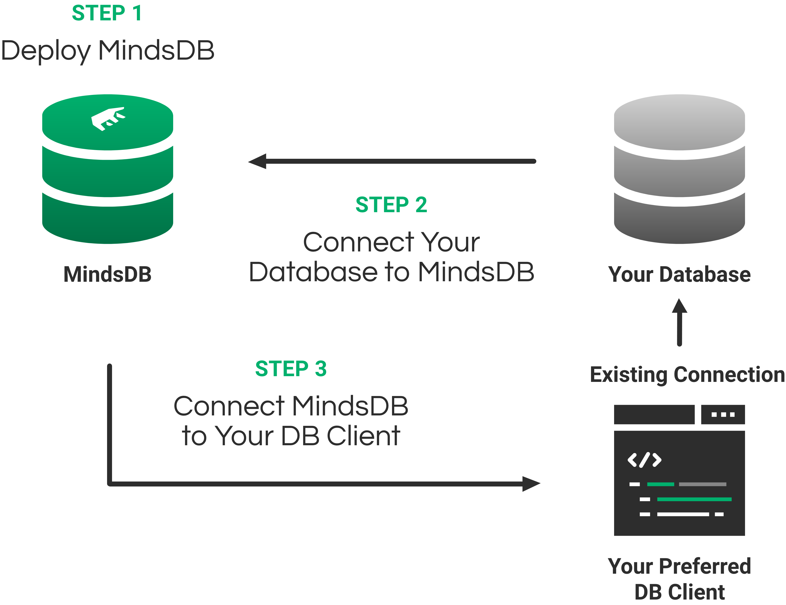

Follow the below steps to get up and running with MindsDB.

#### Steps:

1.  Deploy MindsDB: 
    1.  [Docker](/deployment/docker) OR
    2.  [Pip](/deployment/pypi) OR
    3.  [MindsDB Cloud](/deployment/cloud)
2. [Connect your Data to MindsDB:](/connect)
3. Connect to MindsDB like it was a Database using your preferred DB Client
    1. Using [MindsDB Cloud](/sql/connect/cloud) OR
    2. Using a [Local Deployment](/sql/connect/local)
4. CREATE a predictor (model) trained on your data
5. Make predictions using your model

 
