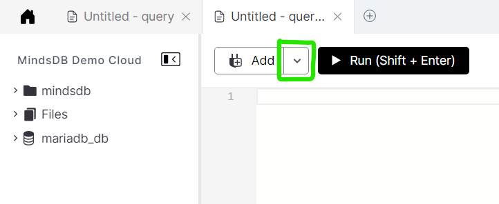
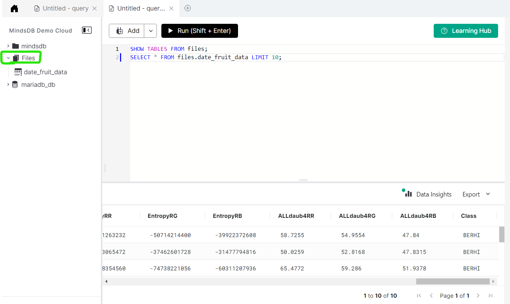

## Introduction
In this tutorial, we’ll create and train a machine learning model, or as **MindsDB** call it, an `AI Table` or a `predictor`. By querying the model, we’ll predict the class of date fruit from these *seven types*: Berhi, Iraqi, Sogay, Deglet, Rotana, Safavi, Dokol. We're going to use **MongoDB** as the datasource here.

### Pre-requisites
1. Make sure you have access to a working MindsDB installation, either locally or at **[MindsDB Cloud](https://cloud.mindsdb.com/)**. If you want to learn how to set up your account at MindsDB Cloud, follow **[this guide](https://docs.mindsdb.com/setup/cloud)**. It takes few minutes only.
2. We need to download **MongoDB Compass** in order to connect with **MindsDB Cloud.** You can download it from **[here](https://www.mongodb.com/try/download/compass)**.


3. We'll be using **[Date Fruit Datasets](https://www.kaggle.com/datasets/muratkokludataset/date-fruit-datasets)**. You need to download a copy of the dataset locally and extract the `.csv` file from it.

Let’s get started.

## Data Setup

### Upload the dataset to MindsDB Cloud
Follow the steps below to upload a file:
1. Log in to your **[MindsDB Cloud](https://cloud.mindsdb.com/login)** account to open the MindsDB Editor.
2. Navigate to `Add` button in the editor and click on the dropdown arrow as highlighted below. Choose the `Upload File` option.



3. Import a file (here it is `Date_fruit.csv`), name the datasource table that is used to store the file (here it is `date_fruit_data`), and click on the `Save and Continue` button.


Now you can run queries directly on the file as if it were a table. Let’s preview the data that we’ll use to train our predictor.
```sql
SHOW TABLES FROM files;
SELECT * FROM files.date_fruit_data LIMIT 10;
```


### Connecting the Data
Let others follow your tutorial by providing information on where to get the data from and how to connect it to MindsDB.


### Understanding the Data
You can briefly introduce the dataset you use.


## Training a Predictor
Here you use the CREATE MODEL command to create a predictor.


## Status of a Predictor
The next step is to check the status of a predictor. If its value is complete, you can proceed to the next chapter.


## Making Predictions
Use the SELECT statement to query for prediction results. It is good to present the output to the readers.
