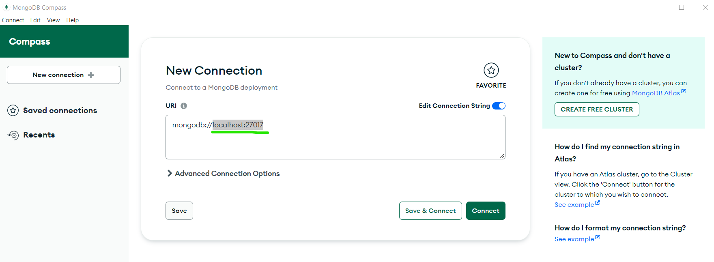
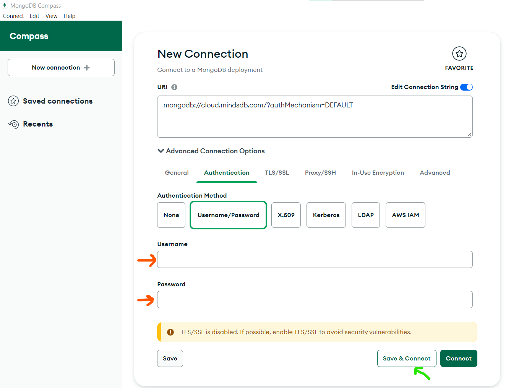
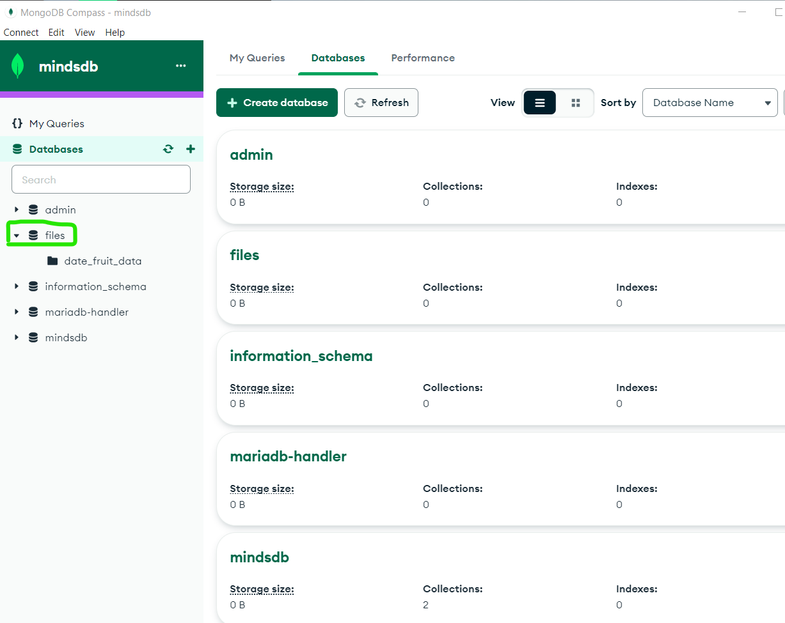
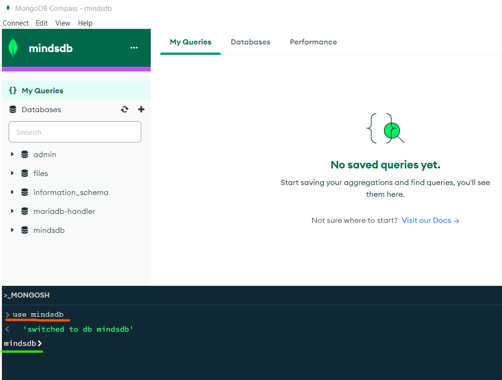
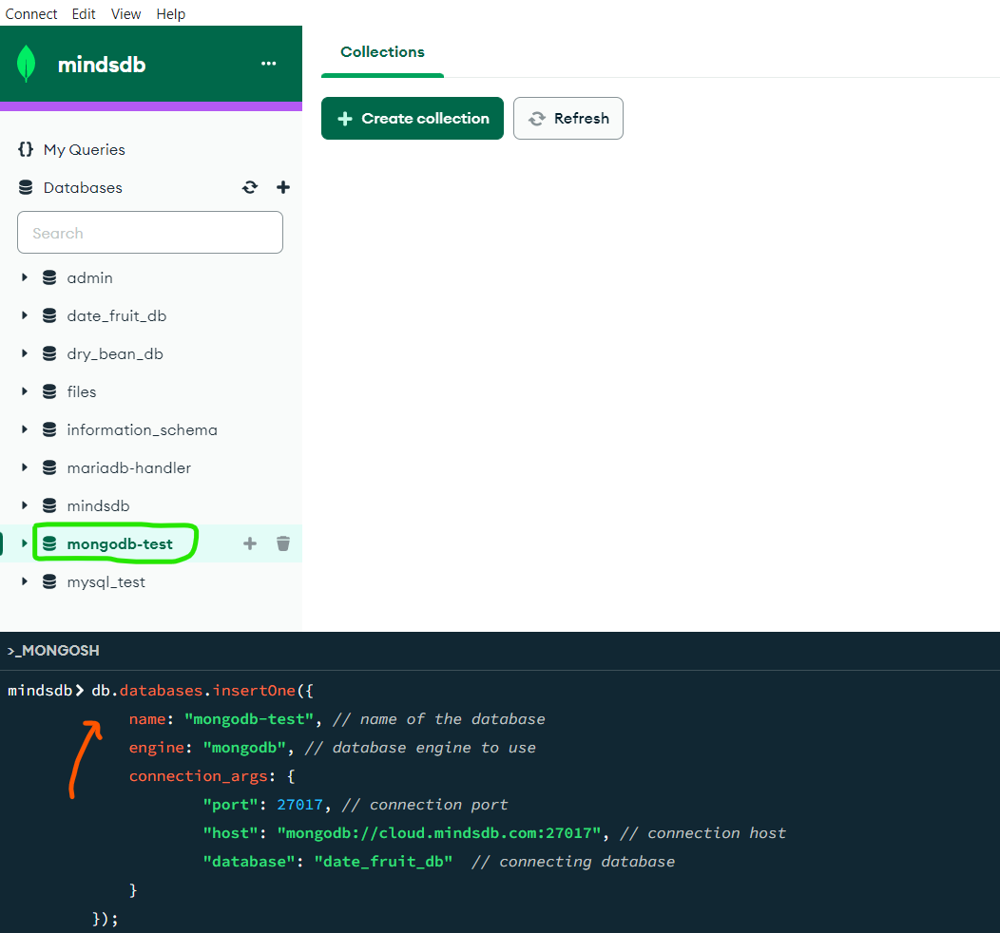
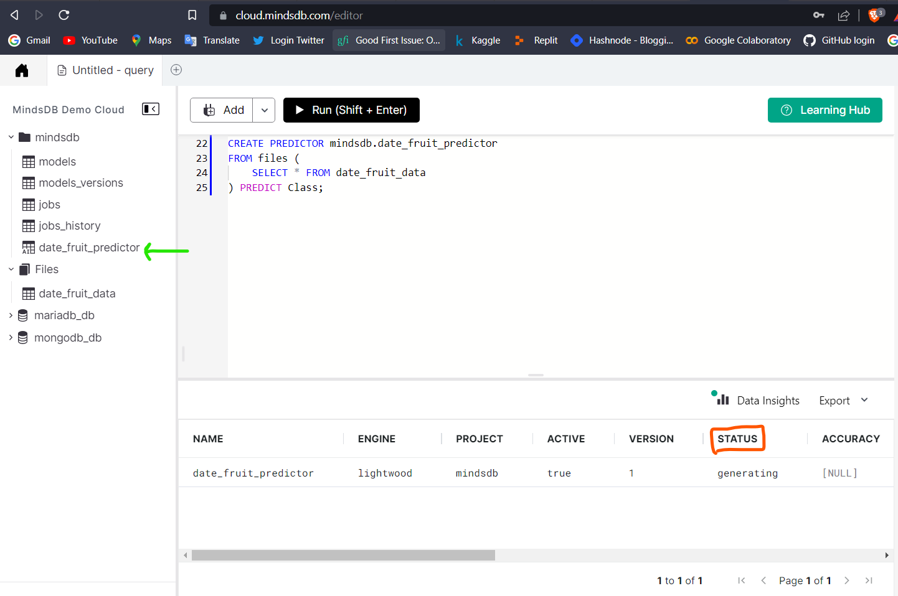
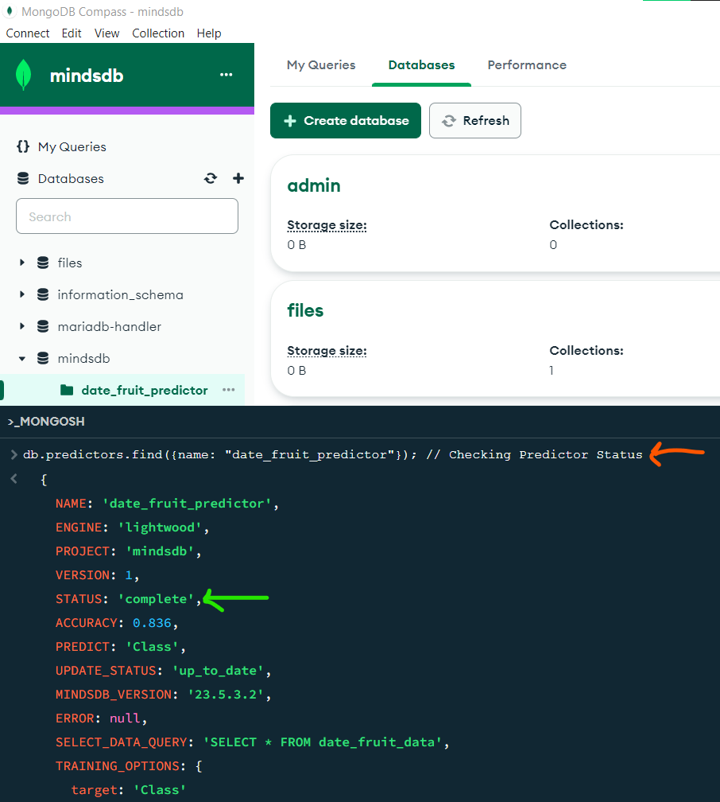
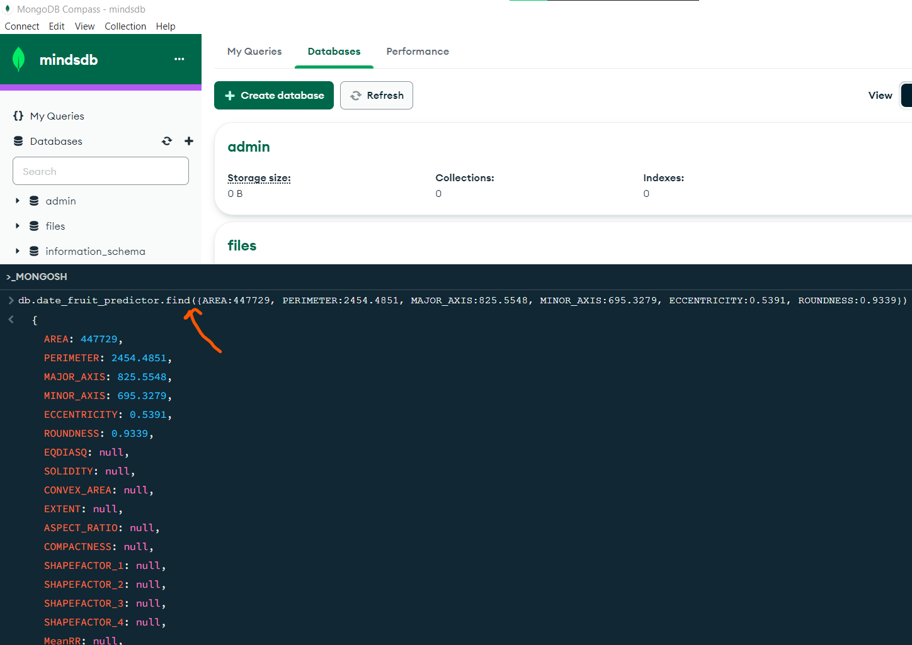
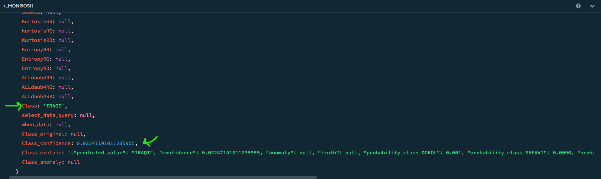

## Introduction
In this tutorial, we’ll create and train a machine learning model, or as **MindsDB** calls it, an `AI Table` or a `predictor`. By querying the model, we’ll predict the class of Date Fruit from these *seven types*: Berhi, Iraqi, Sogay, Deglet, Rotana, Safavi, Dokol. We're going to use **MongoDB** as the data source here.

### Pre-requisites
1. Make sure you have access to a working MindsDB installation, either locally or at **[MindsDB Cloud](https://cloud.mindsdb.com/)**. If you want to learn how to set up your account at MindsDB Cloud, follow **[this guide](https://docs.mindsdb.com/setup/cloud)**. It takes a few minutes only.
2. We need to download **MongoDB Database & MongoDB Compass** in order to connect with **MindsDB Cloud.** You can download the **[Database here](https://www.mongodb.com/try/download/community) & [Compass here.](https://www.mongodb.com/try/download/compass)** Do follow their MongoDB Database download **[guide here](https://www.mongodb.com/docs/manual/installation/)**


3. We'll be using **[Date Fruit Datasets](https://www.kaggle.com/datasets/muratkokludataset/date-fruit-datasets)** from **Kaggle**. You need to download a copy of the dataset locally and extract the `.csv` file from it.

Let’s get started.


## Data Setup

### Connecting the Data
After successful installation, it's now time to connect **MongoDB Compass** with **MindsDB Cloud** and create a *Mongo database*. Follow the steps 👇
1. Create a new connection in **MongoDB Compass** by changing the host value *from* `localhost:27017` *to* `cloud.mindsdb.com` in the **URI** section as highlighted below.



2. Click on `Advanced Connection Options`, then go to `Authentication` tab and click on `Username/Password` button. Now, input the *Username* and *Password* details that is associated to your **MindsDB Cloud account**. After that, click on `Save & Connect` button which will further ask you to save your new connection with a name. (here it is `mindsdb`)



3. Next, you will be directed to a page that will show all databases present in your **MindsDB Cloud** at the left panel along with the `MONGOSH` shell at the bottom. Further you can navigate towards `Databases` tab in the top middle section for more info.



4. In order to use *MongoDB* database, we need to give permission to MindsDB through **MongoDB Compass**. For that, navigate to `MONGOSH` shell and switch to the *mindsdb* project.
```nosql
> use mindsdb
< 'switched to db mindsdb'
```


5. As MindsDB enables adding databases to the Mongo instance using the `db.databases.insertOne()` method, let's create a new *Mongo database* by adding a new connection along with the database credentials. This will  insert this new database in **MindsDB Cloud**.
On a successful connection, you can see the newly created database on the left panel as highlighted below.
```mongodb
db.databases.insertOne({
    name: "mongodb-test", // name of the database
    engine: "mongodb", // database engine to use
    connection_args: {
            "port": 27017, // connection port
            "host": "mongodb://localhost:27017", // connection host
            "database": "date_fruit_db"  // connecting database
    }
});
```


*P.S.: You need to first create a *Mongo Database* locally (here `date_fruit_db`) and add the `date_fruit_data` csv file. Then later you connect the above database with this one.*

### Understanding the Data
We use the **Date Fruit dataset**, where each row are the factors that determine the type of date fruit along with features (columns) such as area, length, diameter, shape, etc. *The external appearance of the fruits is a major determinant of the fruit type.* 

The dataset contains **34 features as external factors and 35th is our target feature to predict, i.e.,** `Class`

**Columns with dtype:**
- AREA               int64
- PERIMETER        float64
- MAJOR_AXIS       float64
- MINOR_AXIS       float64
- ECCENTRICITY     float64
- EQDIASQ          float64
- SOLIDITY         float64
- CONVEX_AREA        int64
- EXTENT           float64
- ASPECT_RATIO     float64
- ROUNDNESS        float64
- COMPACTNESS      float64
- SHAPEFACTOR_1    float64
- SHAPEFACTOR_2    float64
- SHAPEFACTOR_3    float64
- SHAPEFACTOR_4    float64
- MeanRR           float64
- MeanRG           float64
- MeanRB           float64
- StdDevRR         float64
- StdDevRG         float64
- StdDevRB         float64
- SkewRR           float64
- SkewRG           float64
- SkewRB           float64
- KurtosisRR       float64
- KurtosisRG       float64
- KurtosisRB       float64
- EntropyRR          int64
- EntropyRG          int64
- EntropyRB          int64
- ALLdaub4RR       float64
- ALLdaub4RG       float64
- ALLdaub4RB       float64
- Class             object


## Training a Predictor
MindsDB has its own `db.predictors.insertOne()` method, to create and train `predictor` in Mongo. Open up `MONGOSH` shell, copy and paste code from below:
```mongodb
db.predictors.insertOne({
     name: "date_fruit_predictor", // name of the model
     predict: "Class",      // name of the target column to be predicted
     connection: "mongodb-test", // name of the database integration created 
     select_data_query: "db.date_fruit_data.find({})" // object that stores the data collection name
});
```


On successful query run, you can see the `predictor` model under the `mindsdb` database. Also, you have to wait for a few minutes for the model to get trained.


## Status of a Predictor
Let's check the status of our predictor inside `MONGOSH` shell. Once the status changes to **`COMPLETE`**, it means our model is now ready and we can start getting predictions on it.
```mongodb
db.predictors.find({name: "date_fruit_predictor"}); // Checking Predictor Status
```


We can see that **the model has an accuracy of 83.6%**, which is pretty good!


## Making Predictions
To start getting predictions, let's query the `predictor` for the label based on the chosen features. Enter the query below in the `MONGOSH` shell:
```mongodb
db.date_fruit_predictor.find({AREA:447729, PERIMETER:2454.4851, MAJOR_AXIS:825.5548, MINOR_AXIS:695.3279, ECCENTRICITY:0.5391, ROUNDNESS:0.9339});
```


**MindsDB predicted the Class of this Date Fruit type as "IRAQI" with confidence of around 2.24%.** You can feed more data (features) into the `predictor` as that could improve the confidence level of predictions.




## Conclusion
We have now reached the end of this tutorial, where we summarized all the tasks we performed above as a list below:

- [x] Created a **MindsDB Cloud** account, downloaded **MongoDB Database, MongoDB Compass** and the *Date Fruit* dataset from **Kaggle**.

- [x] Imported the dataset into **MindsDB Cloud**, connected the **MindsDB Cloud with MongoDB Compass** and created the *Mongo* database as well.

- [x] Created and trained a Predictor Model for *Date Fruit Classification* with **MongoDB Compass**.

- [x] Gained predictions on the model using `db.date_fruit_predictor.find({column:value});` method.

*Hope you've had fun while trying this tutorial out by yourself!*
