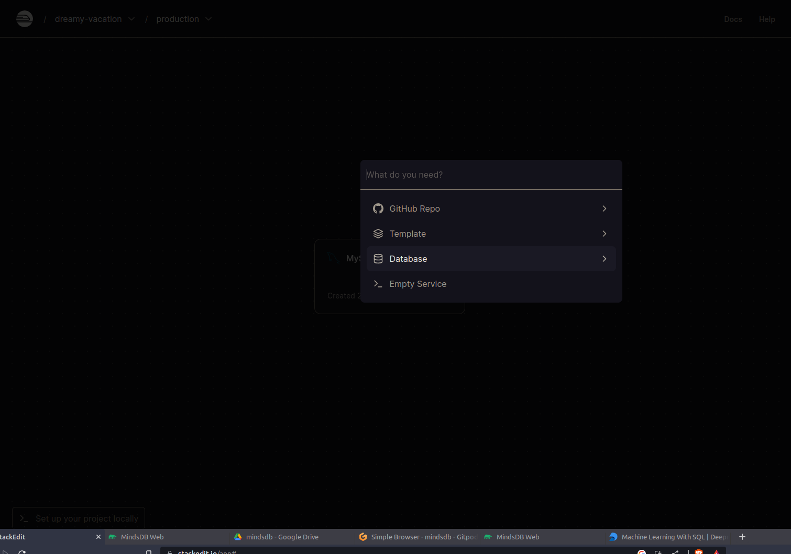
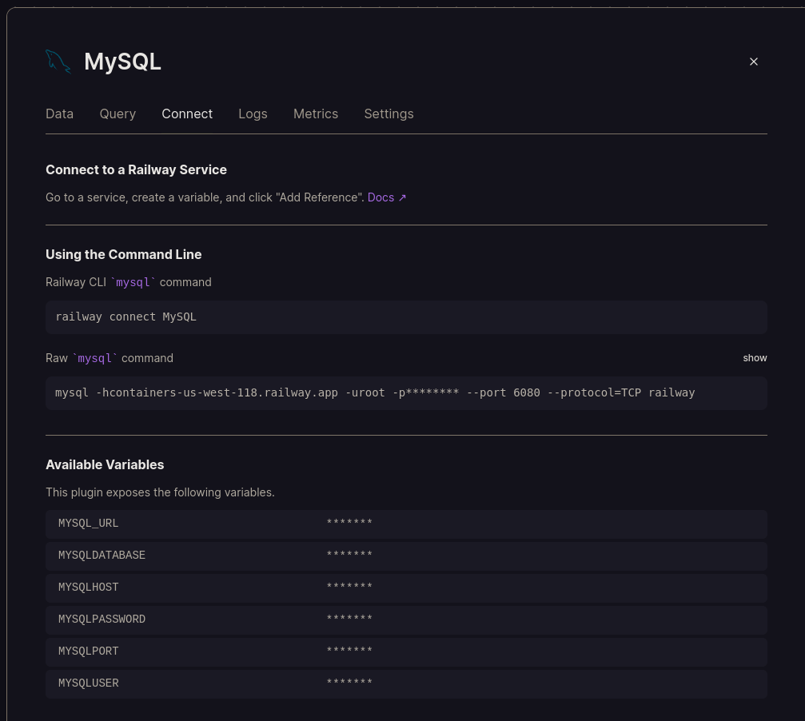
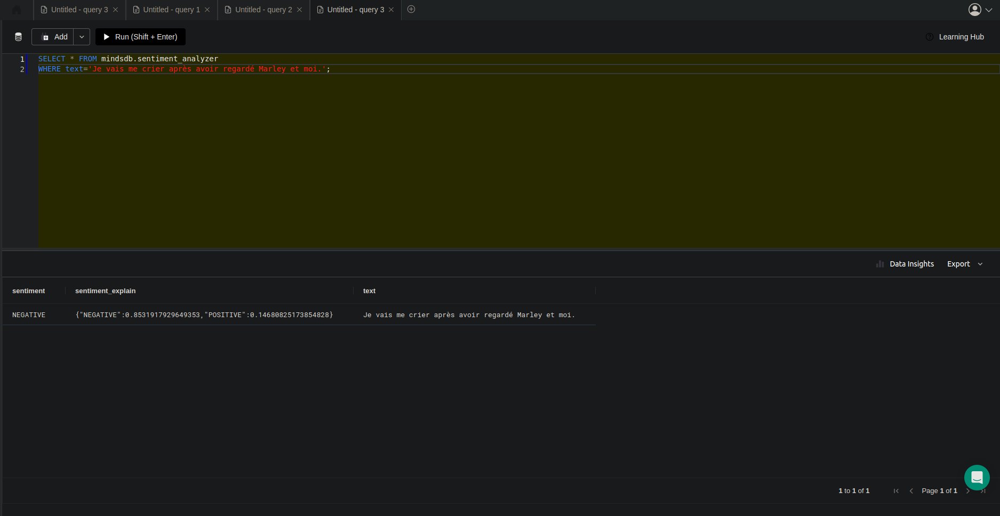
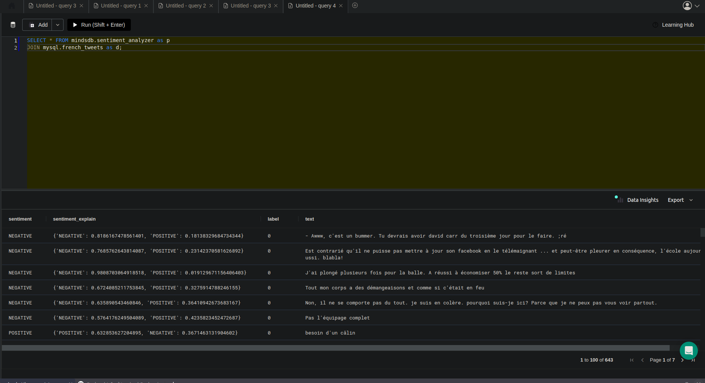

# Sentiment Analysis on French Tweets using MySQL: Connect MindsDB to Sentiment Analysis on French Tweets using MySQL

## Introduction

[MindsDB](https://mindsdb.com/) is is an open-source AI layer for existing databases that allows you to effortlessly develop, train and deploy state-of-the-art machine learning models using SQL queries. 
[Hugging Face](https://huggingface.co/) is a community and data science platform that provides tools that enables users to build, train and deploy machine learning models based on open source code and technologies. 
**NLP**, or Natural Language Processing, is a subprocess of artificial intelligence that helps machines process and understand the human langage so that they can automatically perform repetitive tasks. 
Some examples of NLP include machine translation, summarization, ticket classification, and spell check (or "autocorrect").

The following four NLP tasks are currently supported by MindsDB:

1. Text Classification
2. Zero-Shot Classification
3. Translation
4. Summarization

**In today's tutorial, I'll show you how to connect MindsDB to Hugging Face and use these technologies to perform NLP queries, specifically text-classication, on your dataset.**

## Data Setup

Make sure you have access to a working MindsDB installation, either locally or via [MindsDB Cloud](https://cloud.mindsdb.com/). 

*You can create a **free** MindsDB account and take advantage of their built-in SQL editor [here](https://cloud.mindsdb.com/editor).*

If you want to learn more about creating a free MindsDB Cloud account, follow
[this guide](/setup/cloud/). Another way is to set up MindsDB locally using [Docker](/setup/self-hosted/docker/) or [Python](/setup/self-hosted/pip/source/).

Let's get started!

##  Create MySQL Server and upload the data:
We have many ways to do this. But I recommend this one if you're learning. 
1. Create [Railway Account](https://railway.app/) and add My SQL Database in it.

2. Note the details listed in `Available Variables`

3. Install MySQL Workbench in your local, connect your MySQL Server which is hosted in the Railway App.
4. Download [French Tweets](https://www.kaggle.com/datasets/hbaflast/french-twitter-sentiment-analysis?resource=download) dataset from Kaggle.
5. In Workbench, create schema in name of `french_tweets`  in your database in Workbench. Then upload the downloaded CSV file to it. 


## Connect MySQL Database to MindsDB Web

To establish a database connection we will access MindsDB's GUI. MindsDB has MySQL Database Integration.

First we need to connect MindsDB to the database where the French Tweets data are stored:

 - Access MindsDB GUI on cloud.
 - On the default page, select the button  `Add`  and dropdown appears down, select the `New Datasource` 
 - Select MySQL Database and fill the data connection details such as:
	   - Database Alias Connection name as mysql
	   - Database connection name (check railway dashboard)
	   - Host name (check railway dashboard)
	   - Port (check railway dashboard)
	   - Username (check railway dashboard)
	   - Password (check railway dashboard)
- Once you entered the details, check for test connection.

 
 ## Check whether MySQL Server had connected or not

Once you added the details correctly, you get the `Saved Connection` popup.  In the MindsDB Web, the sidebar display list of databases. You would have created your database in `alias connection` , check for that name in the list and when you click on it, automatically the MindsDB queries the output. 

```
Select * 
FROM mysql.french_tweets;
```
Your output would be like :


## Load the Model

We are focusing on text classification, we're going to use Hugging Face's [French Sentiment analysis model based on CamemBERT](https://huggingface.co/philschmid/pt-tblard-tf-allocine/tree/main) pytorch supported model. This Hugging Face transformer is a CamemBERT model trained on Allocine dataset.

Our Hugging Face integration automatically manages downloading and deploying of pre-trained transformers from Hugging Face's hub. For example, we can download a transformer which has been trained to analyze the sentiment of text:
```
CREATE  MODEL mindsdb.sentiment_analyzer
PREDICT sentiment
USING
engine  =  'huggingface',
task =  'text-classification',
model_name =  'philschmid/pt-tblard-tf-allocine',
input_column =  'text';
```
To create a model in MindsDB, we first specify our chosen model name (sentiment_classifier) with **CREATE MODEL mindsdb.sentiment_analyzer.**

Next, we choose the name of the column we would like to predict (sentiment) with **PREDICT sentiment**. Hugging Face models are already trained, so we don’t need to select a column from our training data - we can name our column whatever we like.

Finally, we specify all the additional variables we need after **USING**. Each ML handler has slightly different parameters (for more details on Hugging Face you can check our [documentation](https://docs.mindsdb.com/custom-model/huggingface?_gl=1*dxyiz5*_ga*MjEyNzE5MjgzMy4xNjY4Nzg5OTkz*_ga_7LGFPGV6XV*MTY3MDkwMjEwOS41Mi4xLjE2NzA5MDI4ODYuNjAuMC4w).) In this case, we specify:  

-   **engine = ‘huggingface’**  - the name of the ML framework to be used. Other options include ‘lightwood’ and ‘luwig’
-   **model_name = 'philschmid/pt-tblard-tf-allocine'**  - the name of the model from  [Hugging Face](https://huggingface.co/models)
-   **input_column = 'text'**  - the name of the input column that has your text.

We currently support four of the Hugging Face NLP tasks: ‘text-classification’, ‘zero-shot-classification’, ‘translation’, and ‘summarization’. This model is ‘text-classification’.

Once the above query is executed, we can check the status of the creation process:
```
DESCRIBE sentiment_analyzer;
```
After a few seconds you should see the status change from **generating** to **complete.**

## Making predictions

Once the status is complete, the behavior is the same as with any other AI table you can query it or by directly specifying your inputs, You can query it directly by specifying your inputs:

```
SELECT  *  FROM mindsdb.sentiment_analyzer
WHERE  text='Je vais me crier après avoir regardé Marley et moi.';
```

The above query should analyze the text and give the output as below:

```sql
| sentiment | sentiment_explain | text |
| --------- | ----------------- | ---- |
| NEGATIVE | {"NEGATIVE":0.8531917929649353,"POSITIVE":0.14680825173854828} | Je vais me crier après avoir regardé Marley et moi. |
```


Or by joining with the data table for batch predictions:

```
SELECT * FROM mindsdb.sentiment_analyzer as p
JOIN mysql.french_tweets as d;
```



## Conclusion

MindsDB enables in-database ML with your favorite frameworks, you just need a handler for it. If this sounds exciting, head over to the community slack and we will be happy to guide you on using other handlers or writing your own!

By following this tutorial, you just learned how to perform the following tasks with MindsDB:

- [x]  How to load data in database.
- [x]  How to connect datasource to MindsDB.
- [x]  Select the data.
- [x]  Create Model that includes HuggingFace as the engine and the above mentioned model.
- [x]  Select the model to show the status.
- [x] Query the model.

Great work!

Got some more ideas about how MindsDB can be used to perform NLP tasks? 
Sign up for a free MindsDB cloud account [here](https://cloud.mindsdb.com/) and get started today!

Want to learn more about MindsDB? Checkout these resources:
- [MindsDB](https://mindsdb.com/)
-[Slack](https://mindsdb.com/joincommunity)
- [GitHub](https://github.com/mindsdb/mindsdb/)