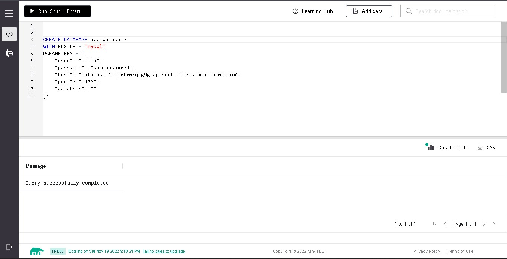
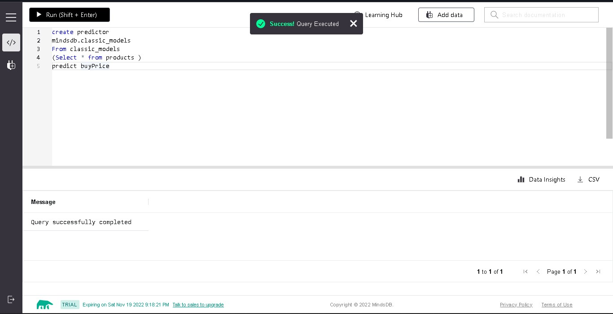
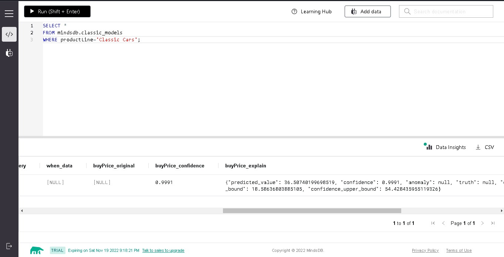
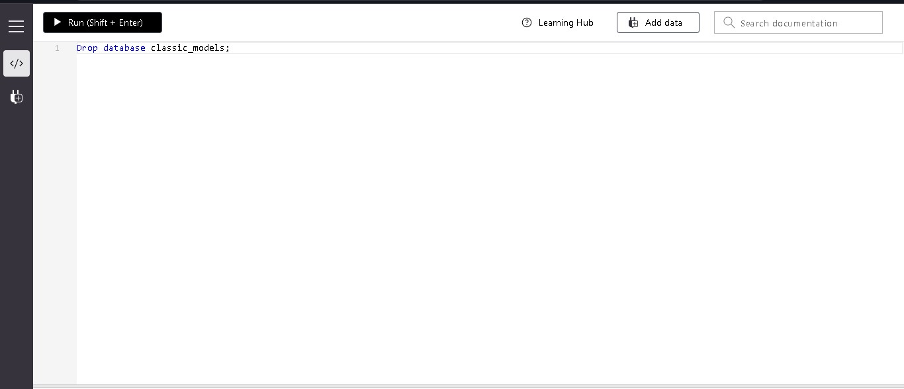

## Testing MySQL Handler with [ClassicModels](https://github.com/hhorak/mysql-sample-db/blob/master/mysqlsampledatabase.sql)

1. Testing CREATE DATABASE

```
CREATE DATABASE display_name
WITH ENGINE = 'mysql',
PARAMETERS = {
    "user": "admin",
    "password": "salmansayyed",
    "host": "database-1.cpyfvwxqjg9g.ap-south-1.rds.amazonaws.com",
    "port": "3306",
    "database": "classicModels"
};
```



2. Testing CREATE PREDICTOR

```
create predictor
mindsdb.classic_models
From classic_models
(Select * from products )
predict buyPrice
```



3. Testing SELECT FROM PREDICTOR

```
SELECT *
FROM mindsdb.classic_models
WHERE productLine='Classic Cars';
```



4. Testing DROP THE DATABASE

```
DROP TABLE mindsdb.classic_models;
DROP DATABASE classic_models;
```



### Results

Drop a remark based on your observation.

- Works Great 💚
- Everything worked great but, i faced a wierd error while deleting the database from mindsdb
- "Unable to drop: is linked to predictor classic_models
  "
- So i deleted the table in which the predictors are stored
- "DROP TABLE mindsdb.classic_models;"
- After this i tried again to drop the database.
- It did'nt worked, still shows the same error.
