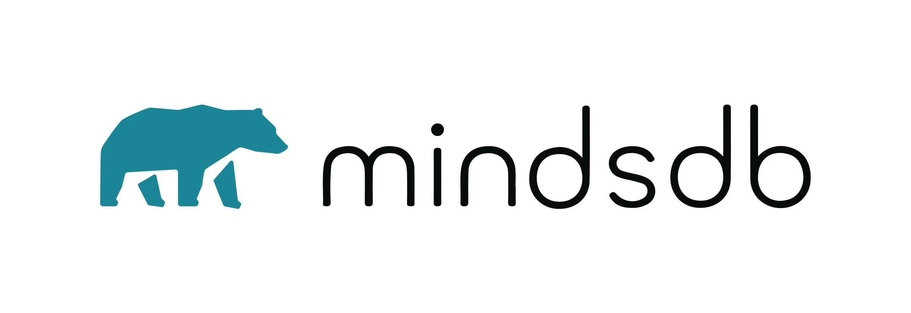
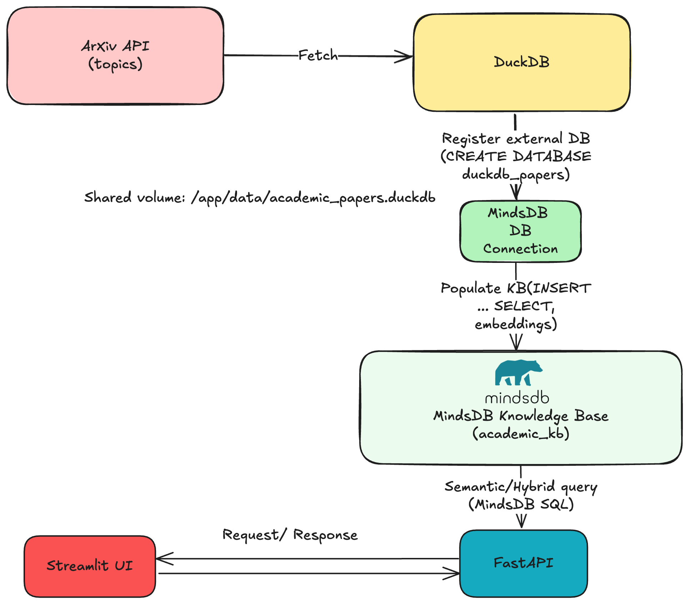
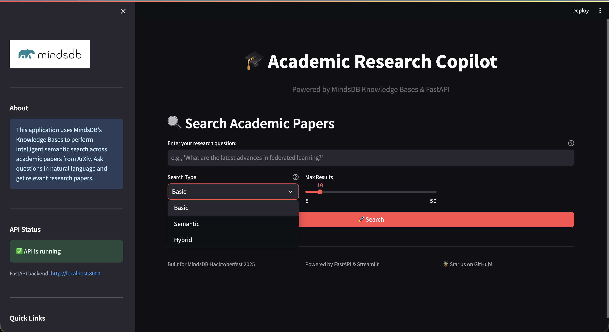
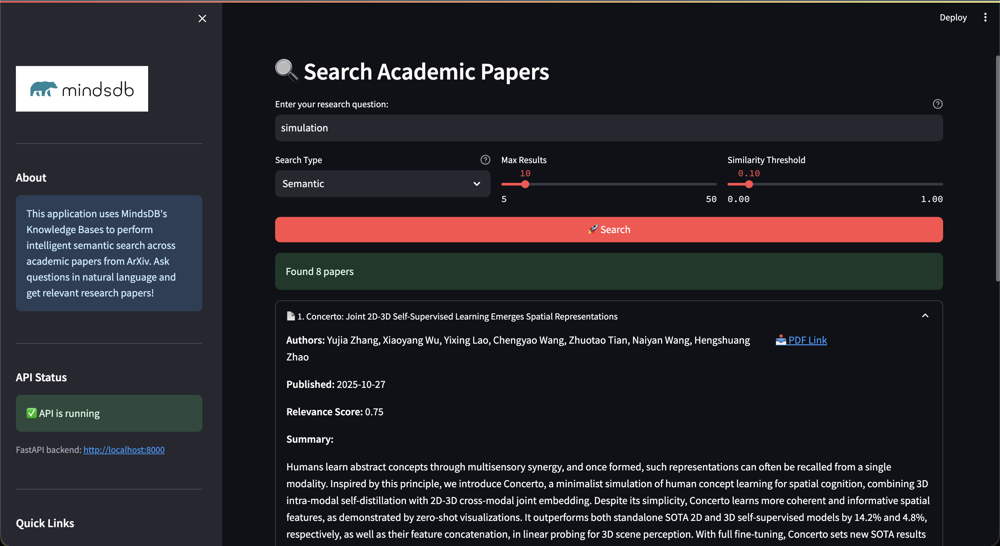

# Academic Research Copilot
<p align="center">
  
</p>


Find the right papers faster with hybrid semantic search over ArXiv, powered by MindsDB Knowledge Bases, DuckDB, FastAPI, and Streamlit.

## Problem statement

Researchers drown in information: keyword search misses context, and scanning dozens of PDFs is slow. This project solves that by:

- Ingesting recent ArXiv papers into a local DuckDB database
- Indexing them into a MindsDB Knowledge Base with vector embeddings
- Exposing simple APIs and a web UI for semantic and hybrid (semantic + metadata) search

Outcomes:
- Ask natural‑language questions (e.g., “privacy in federated learning”) and retrieve relevant papers, even without exact keyword matches
- Filter by authors, year, or categories when needed
- Run fully locally with Docker; embeddings via Google Gemini or fall back to local sentence-transformers

## Architecture

- Data ingestion: `arxiv` → `DuckDB (papers table)`
- Vector index: `DuckDB.papers` → `MindsDB Knowledge Base (academic_kb)`
- Backend API: FastAPI (`/api/search`, `/api/search/semantic`, `/api/search/hybrid`)
- UI: Streamlit app calling the API

<p align="center">
  
  <br />
  <em>High-level architecture: ingest (ArXiv → DuckDB), index (MindsDB KB), and serve (FastAPI + Streamlit)</em>
</p>

Key files:
- `src/data/fetch_papers.py` – create DuckDB and ingest ArXiv metadata
- `src/knowledge_base/kb_manager.py` – connect DuckDB to MindsDB and create/populate KB
- `src/knowledge_base/queries.py` – semantic and hybrid search queries
- `src/api/routes.py`, `src/app.py` – FastAPI endpoints
- `src/ui/streamlit_app.py` – Streamlit front‑end

> Deep dive: Read the blog post “[Building the Academic Research Copilot](docs/blog/academic-research-copilot.md)” for the story, key design decisions, and code/SQL walk‑throughs.

## Knowledge Base schema

Two layers of data are used: the raw table in DuckDB and the semantic index in MindsDB.

### DuckDB: `papers`

Created by `src/data/fetch_papers.py` and `scripts/fetch_papers.py`.

- `entry_id` TEXT PRIMARY KEY (e.g., arXiv ID/URL)
- `title` TEXT
- `summary` TEXT (abstract)
- `authors` TEXT (comma‑separated)
- `published_date` DATE
- `pdf_url` TEXT
- `categories` TEXT (comma‑separated)
- `created_at` TIMESTAMP DEFAULT CURRENT_TIMESTAMP

Note: An older helper script uses column `id`; the main pipeline uses `entry_id` consistently.

### MindsDB Knowledge Base: `academic_kb`

Created once via SQL (see below). Content columns are embedded; metadata columns are stored alongside. MindsDB adds query-time fields like `relevance` and `distance`.

- `entry_id` – unique identifier matching DuckDB
- `title`, `summary` – used as `content_columns` for embeddings
- `authors`, `published_date`, `pdf_url`, `categories` – metadata
- Query-time fields: `relevance` (higher is better), `distance` (lower is closer), `chunk_content`

Embedding model (default in repo): Google Gemini `text-embedding-004` (free API key via `GEMINI_API_KEY`). The project also includes `sentence-transformers` for local embeddings as a fallback.

## Screenshots

<p align="center">
  
  <br />
  <em>Initial landing page of the Academic Research Copilot UI</em>
  <br /><br />
  
  <br />
  <em>Semantic search results for a natural‑language query</em>
  <br />
</p>

## SQL examples

All queries run through the MindsDB SQL endpoint (FastAPI and the UI call these under the hood).

### 1) Create Knowledge Base (embeddings + schema)

```
CREATE KNOWLEDGE_BASE academic_kb
USING
  embedding_model = {
    "provider": "google",
    "model_name": "text-embedding-004",
    "api_key": "${GEMINI_API_KEY}"
  },
  content_columns = ['title','summary'],
  id_column = 'entry_id';
```

### 2) Connect DuckDB inside MindsDB

```
CREATE DATABASE duckdb_papers
WITH ENGINE = 'duckdb'
PARAMETERS = {
  'database': '/app/data/academic_papers.duckdb'
};
```

### 3) Populate the Knowledge Base from DuckDB

```
INSERT INTO academic_kb
SELECT entry_id, title, summary, authors, published_date, pdf_url, categories
FROM duckdb_papers.papers;
```

### 4) Semantic search (natural language)

```
SELECT entry_id, title, summary, authors, published_date, pdf_url, categories,
       distance, relevance
FROM academic_kb
WHERE content = 'privacy in federated learning'
ORDER BY relevance DESC
LIMIT 10;
```

### 5) Hybrid search with simple metadata filters

```
-- Filter by category and recent year
SELECT entry_id, title, authors, published_date, categories, relevance
FROM academic_kb
WHERE content = 'diffusion models for images'
  AND LOWER(categories) LIKE '%cs.cv%'
  AND CAST(LEFT(published_date, 4) AS INT) >= 2023
ORDER BY relevance DESC
LIMIT 10;
```

### 6) Basic counts and health checks

```
-- How many raw papers are ingested?
SELECT COUNT(*) AS n FROM duckdb_papers.papers;

-- How many chunks/vectors are indexed in the KB?
SELECT COUNT(*) AS n FROM academic_kb;
```


## Try it locally

### 🐳 Docker (recommended)

1) Set an API key (zsh/bash):

```bash
export GEMINI_API_KEY=your_key_here
```

2) Start the stack:

```bash
docker compose up --build
```

3) Populate the Knowledge Base (first run only):

```bash
docker compose exec academic_research_copilot python scripts/populate_kb.py
```

4) Open the apps:

- UI: http://localhost:8501
- API docs: http://localhost:8000/api/docs

> Tip: The first populate builds embeddings and can take a few minutes; subsequent runs are much faster.

### 🐍 Local (Python)

1) Create and activate a virtual environment (zsh/bash):

```bash
python -m venv venv
source venv/bin/activate
```

2) Install dependencies:

```bash
pip install -r requirements.txt
```

3) Populate the Knowledge Base (first run only):

```bash
python scripts/populate_kb.py
```

4) Start the apps (use two terminals or tabs):

- Terminal A — FastAPI:

```bash
uvicorn src.app:app --reload
```

- Terminal B — Streamlit:

```bash
streamlit run src/ui/streamlit_app.py
```

Then open:

- UI: http://localhost:8501
- API docs: http://localhost:8000/api/docs

## Notes

- Embeddings: default config uses Google Gemini `text-embedding-004`. If you prefer fully local embeddings, you can adapt `scripts/populate_kb.py` and `src/knowledge_base/kb_manager.py` to use `sentence-transformers/all-MiniLM-L6-v2`.
- Paths: when running in Docker, MindsDB reads DuckDB from `/app/data/academic_papers.duckdb` (volume‑mounted). Locally it’s `data/academic_papers.duckdb`.
- API surface: see `docs/api_reference.md` for request/response examples; architecture overview in `docs/architecture.md`.

Link to Blog: https://dev.to/aashish079/building-the-academic-research-copilot-from-arxiv-to-semantic-search-in-minutes-21bc

Link to Youtube Demo: https://youtu.be/ZJKnf6hAu9A

Original Github Repo Link: https://github.com/Aashish079/academic-research-copilot

Linkedin Post: https://www.linkedin.com/posts/aashish-karki-718757233_as-every-year-mindsdb-came-up-with-a-hacktoberfest-activity-7389197994379694080-WS0w?utm_source=share&utm_medium=member_desktop&rcm=ACoAADpPTEQB8pGO4ol67eOpmYl6D2TL04V8P0I