# Janus

**Janus** is an AI-powered helpdesk system that makes customer support faster and smarter. It helps users raise support tickets, get instant AI replies, and lets admins manage everything from one simple dashboard.

## Use Case

Enterprise helpdesks spend hours triaging and responding to repetitive support requests.
Janus automates the lifecycle:

- Users submit tickets and chat with an AI support agent in real time.
- The system classifies intent, priority, and category automatically.
- Admins can visualize ticket trends, approve high-value cases into the Knowledge Base, and run searches across historical data.

**Result:** Reduced response time, consistent resolutions, and actionable insights.

## Features

**🎟️ User Portal**

- Submit new support tickets.
- Get an instant AI-generated first response.
- Chat with the AI about your issue.
- View all your previous tickets in one place.

**🧠 Admin Portal**

- View visual dashboards showing ticket trends.
- Review and manage tickets — approve useful ones for the Knowledge Base or delete them.
- Search the Knowledge Base using filters like priority, type, or category.

**🤖 AI Agents**

1. Ticket Classifier

- Predicts ticket type, category, tags, and priority.
- Learns from past tickets to improve classification accuracy over time.

2. Support Agent

- Generates the first AI response for every new ticket.
- Handles ongoing chats with users to resolve their issues.
- Uses the tickets knowledge base for context and better answers.

## Technology

- [Python](https://www.python.org/) (Best Programming Language :P)
- [Streamlit](https://streamlit.io/) (UI Library)
- [MindsDB](https://mindsdb.com/) (AI and KB Layer)
- [ChromaDB](https://www.trychroma.com/) (Vector DB)
- [Nebius](https://nebius.com/) (For LLM and Embedding model)

## Architecture

```mermaid
graph TD
    subgraph "Streamlit"
        UI[💻 UI / Portal]
    end

    subgraph "MindsDB"
        Classifier[🤖 Ticket Classifier Agent]
        SupportAgent[🤖 Support Agent]
        KB["📚 Knowledge Base (tickets_kb)<br><i>Vector DB: ChromaDB</i>"]
    end

    subgraph "Nebius AI"
        LLM["🧠 LLM<br>Qwen3-235B-A22B-Thinking-2507"]
        Embedding["🔍 Embedding Model<br>Qwen3-Embedding-8B"]
    end

    %% --- Connections ---
    UI -- "Creates Tickets" --> Classifier
    UI -- "Interacts with" --> SupportAgent
    UI -- "Direct Search" --> KB
    
    Classifier -- "Uses for Classification" --> LLM
    SupportAgent -- "Uses for Replies" --> LLM

    Classifier -- "Retrieves Context" --> KB
    SupportAgent -- "Retrieves Context" --> KB
    
    KB -- "Embeddings Created Using" --> Embedding      
```



### Knowledge Base Schema

Name: `tickets_kb` 

```
    content_columns = ["subject", "body", "answer"],
    metadata_columns = ["type", "priority", "category", "tag_1", "tag_2"],
    id_column = "id"
```

### Knowledge Base Evaluation metrics

| avg_relevancy | avg_relevance_score_by_k | avg_first_relevant_position | mean_mrr | hit_at_k | bin_precision_at_k | avg_entropy | avg_ndcg | avg_query_time | id  | name | created_at |
| ------------- | ------------------------ | --------------------------- | -------- | -------- | ------------------ | ----------- | -------- | -------------- | --- | ---- | ---------- |
| 0.6787063013430905 | [0.71,0.7,0.64,0.72,0.67,0.69,0.67,0.68,0.63,0.68] | 0.24489795918367346 | 0.8733333333333333 | [0.78,0.94,0.98,0.98,0.98,0.98,0.98,0.98,0.98,0.98] | [0.78,0.76,0.73,0.74,0.72,0.72,0.73,0.72,0.71,0.71] | 2.251819234946442 | 0.9207420352312292 | 1.2846330642700194 | 1761655277 | tickets_kb | 2025-10-28 12:41:17.967865 |


## Installation

1. Clone the github repository

```bash
git clone https://github.com/k0msenapati/janus.git
cd janus
```

2. Download the dataset

```bash
# Create data directory if not exists
mkdir -p data

# Download dataset zip via Kaggle API
curl -L -o data/customer-support-tickets.zip \
  https://www.kaggle.com/api/v1/datasets/download/tobiasbueck/multilingual-customer-support-tickets

# Unzip contents to data directory
unzip -o data/customer-support-tickets.zip -d data

# Optional: remove the zip after extraction
rm data/customer-support-tickets.zip
```

3. Setup project, environment variables and run setup script

```bash
uv sync

cp .env.example .env # add your nebius api key from nebius ai cloud to NEBIUS_API_KEY var

uv run setup.py
```

4. Run Streamlit App

```bash
source .venv/bin/activate
streamlit run app.py
```

---

## Social Links:

Devto: https://dev.to/k0msenapati/building-janus-an-ai-powered-helpdesk-that-makes-customer-support-smarter-h6c

X: https://x.com/k0msenapati/status/1982458955788861544

LinkedIn: https://www.linkedin.com/posts/k0msenapati_introducing-janus-ai-powered-helpdesk-activity-7388241250610499584-Apcf

## 🎬 Demo Video

[](https://www.youtube.com/watch?v=xSJRbmtMBGI)

## Author

Built with 💖 by [k0msenapati](https://github.com/k0msenapati)
