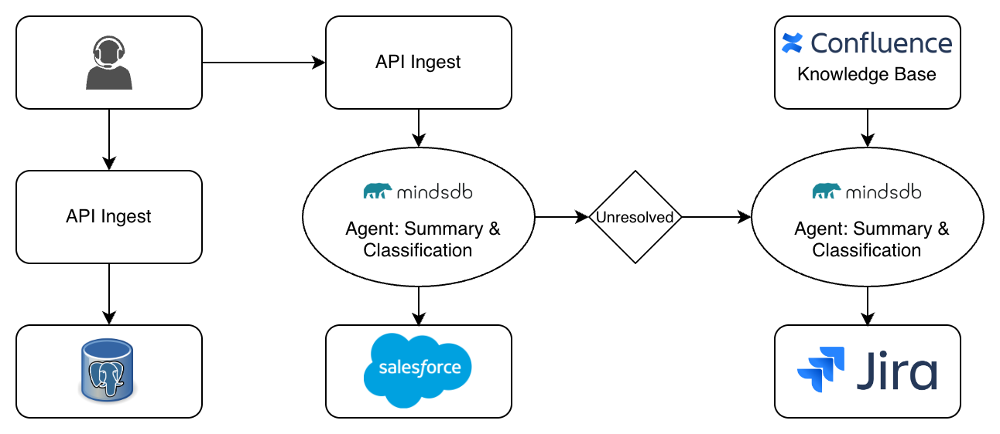

# AutoBanking Customer Service Workflow

**A MindsDB Use Case Demo**

An intelligent automated customer service pipeline for banking operations that showcases MindsDB's AI agent orchestration, RAG knowledge base, and enterprise integration capabilities.

✨ **[Read the Blog Post on DEV](https://dev.to/jiaqicheng1998/building-agentic-workflow-auto-banking-customer-service-with-mindsdb-484p)**
✨ **[Watch the Demo on Youtube](https://www.youtube.com/watch?v=cu2ElOprpBE)**
✨ **[Interact with Us on LinkedIn](https://www.linkedin.com/feed/update/urn:li:activity:7388469604718854145/)**
---

## 📑 Table of Contents

- [Problem Statement](#problem-statement)
- [Architecture Overview](#architecture-overview)
- [Knowledge Base Schema](#knowledge-base-schema)
- [Results & Impact](#results--impact)
- [Project Structure](#project-structure)
- [API Endpoints](#-api-endpoints)
- [Related Resources](#-related-resources)

---

## Problem Statement

In banking customer support, agents are required to listen to customer issues while simultaneously taking notes, organizing information, and entering data across multiple systems. This workflow is cumbersome and inefficient. When a case is not resolved during the interaction, business teams must manually review it and create Jira tickets, relying heavily on human judgment. As a result, issue classification can be inconsistent, escalations may be delayed, and key information may be missed. For more complex cases, the process from call completion to proper documentation and escalation often takes more than 15 minutes, leading to lower agent productivity, unstable customer experience, and rising operational costs.

AutoBankingCustomerService uses MindsDB’s AI orchestration to automate the entire post-call workflow. The system automatically summarizes each interaction, determines whether the issue has been resolved, and, when needed, generates recommended next steps using internal knowledge bases. For unresolved cases, Jira tickets with clear action guidance are created automatically, eliminating the need for manual intervention.

This solution reduces processing time from roughly 15 minutes to under 2 minutes, ensures consistent classification and escalation logic, and delivers full automation from conversation transcript to task assignment—implemented and deployed in just 48 hours.

---

## Architecture Overview

### System Architecture Diagram



### Architecture Components

#### 1. **Data Sources Layer**
- **PostgreSQL**: Stores raw call transcripts from Gong (mocked in development)
  - Table: `banking_conversations` (raw messages)
  - Table: `banking_conversations_preprocessed` (aggregated conversations)
- **Confluence**: Enterprise knowledge base with customer complaint handling policies


#### 2. **MindsDB Layer** (AI Orchestration Hub)

**Knowledge Base (RAG Engine)**:
- Ingests Confluence pages and creates vector embeddings
- Enables semantic search over enterprise documentation
- Automatically injects relevant context into agent prompts

**Classification Agent**:
- Input: Raw conversation text from PostgreSQL
- Output: Summary (2-3 sentences) + Status (RESOLVED/UNRESOLVED)
- Model: GPT-4o or efficient equivalent

**Recommendation Agent**:
- Input: Unresolved conversation + Knowledge Base context
- Output: Actionable recommendations based on enterprise policies
- Model: GPT-4o (higher capability for policy reasoning)

#### 3. **Orchestration Layer** (Python Backend)

**FastAPI Server**: Coordinates the entire workflow
- Receives call transcripts via API
- Queries MindsDB agents
- Writes results to Salesforce and Jira
- Maintains security boundaries (all write operations go through our backend)

#### 4. **Output Systems**
- **Salesforce**: Receives ALL conversations with summaries and classification
- **Jira**: Receives ONLY unresolved cases with AI-generated recommendations

### Data Flow Sequence

```
1. Call Transcript → PostgreSQL
2. Python Backend → Query Classification Agent (MindsDB)
3. Classification Agent → Return Summary + Status
4. Python Backend → Create Salesforce Case (ALL conversations)
5. IF Status = UNRESOLVED:
   a. Python Backend → Query Recommendation Agent (MindsDB)
   b. Recommendation Agent → Query Knowledge Base (RAG)
   c. Knowledge Base → Return Relevant Policy Docs
   d. Recommendation Agent → Generate Action Plan
   e. Python Backend → Create Jira Ticket (with recommendations)
```

---

## Knowledge Base Schema

### Overview

The Knowledge Base is MindsDB's built-in RAG (Retrieval Augmented Generation) engine that eliminates the need for custom vector database infrastructure. It automatically handles:
- Document chunking
- Embedding generation (OpenAI `text-embedding-3-small`)
- Vector indexing
- Semantic search
- Context injection into agent prompts

### Schema Definition

```sql
CREATE KNOWLEDGE_BASE my_confluence_kb
USING
    embedding_model = {
        "provider": "openai",
        "model_name": "text-embedding-3-small",
        "api_key": "<your-api-key>"
    },
    content_columns = ['body_storage_value'],  -- Confluence page content
    id_column = 'id';                          -- Unique page identifier
```

### Data Ingestion

```sql
-- Ingest specific Confluence pages into the Knowledge Base
INSERT INTO my_confluence_kb (
    SELECT id, title, body_storage_value
    FROM my_confluence.pages
    WHERE id IN ('360449', '589825')  -- Customer Complaint Handling pages
);
```

### Knowledge Base Queries

```sql
-- Verify ingestion
SELECT COUNT(*) as total_chunks FROM my_confluence_kb;

-- Search for specific content
SELECT chunk_content
FROM my_confluence_kb
WHERE chunk_content ILIKE '%complaint escalation%'
LIMIT 5;

-- Inspect Knowledge Base structure
DESCRIBE KNOWLEDGE_BASE my_confluence_kb;
```

### Agent Integration

The Recommendation Agent automatically queries the Knowledge Base without explicit SELECT statements:

```sql
CREATE AGENT recommendation_agent
USING
    model = {
        "provider": "openai",
        "model_name": "gpt-4o",
        "api_key": "<your-api-key>"
    },
    data = {
        "knowledge_bases": ["mindsdb.my_confluence_kb"]  -- Auto-inject context
    },
    prompt_template = 'You are a Banking Customer Issue Resolution Consultant.
    Use my_confluence_kb to reference official policies and procedures.

    Provide clear operational recommendations for this UNRESOLVED case:
    {{question}}';
```

### Content Sources

Our Knowledge Base contains two key Confluence pages:

| Page ID | Title                                  | Purpose                                      |
|---------|----------------------------------------|----------------------------------------------|
| 360449  | Customer Complaints Management Policy  | Official complaint handling procedures       |
| 589825  | Complaint Handling Framework           | Escalation workflows and resolution criteria |


### Environment Variables

The `.env.example` file includes all configuration options:

**Required:**
- `OPENAI_API_KEY`: Your OpenAI API key for AI agents

**Pre-configured (Docker Compose):**
- `DB_HOST`, `DB_PORT`, `DB_NAME`, `DB_USER`, `DB_PASSWORD`: PostgreSQL settings
- `MINDSDB_URL`: MindsDB HTTP endpoint

**Optional (for full integration):**
- `SALESFORCE_*`: Salesforce CRM credentials
- `JIRA_*`: Jira workspace credentials
- `CONFLUENCE_*`: Confluence knowledge base credentials

### Testing

```bash
# Test single conversation processing
python3.11 test_single_conversation.py

# Test recommendation workflow (includes AI recommendations)
python3.11 test_recommendation.py
```

### Stopping Services

```bash
# Stop all services
docker-compose down

# Stop and remove all data
docker-compose down -v
```

## Results & Impact

### Operational Efficiency
- **84% time reduction**: From 15+ minutes to under 2 minutes per case
- **Zero manual intervention**: Complete end-to-end automation
- **Automated routing**: Intelligent escalation to appropriate teams

## Project Structure

```
AutoBankingCustomerService/
├── app/                          # Core application code
│   ├── __init__.py              # FastAPI app initialization
│   ├── api.py                   # API routes and schemas
│   ├── db.py                    # Database utilities
│   ├── services.py              # Business logic
│   ├── mindsdb.py               # MindsDB client
│   ├── jira_client.py           # Jira integration
│   ├── salesforce_client.py     # Salesforce integration
│   └── recommendation_client.py # AI recommendation client
├── script/                       # Data import scripts
│   ├── banking_sample_10k.csv  # Sample banking data
│   └── import_banking_data.py   # Data import utility
├── test_*.py                     # Test scripts
├── server.py                     # Application entry point
├── mindsdb_setup.sql            # MindsDB configuration
├── env.template                 # Environment variables template
├── requirements.txt             # Python dependencies
└── README.md                    # This file
```

---

## 📝 API Endpoints

### Core Endpoints
- `GET /health`: Health check endpoint
- `POST /api/process-conversations`: Process customer conversations in batch

### Request Format
```json
{
  "conversation_texts": [
    "agent: Hello, how can I help you today?\nclient: I have an issue with my account..."
  ]
}
```

### Response Format
```json
{
  "success": true,
  "total_conversations": 1,
  "processed_count": 1,
  "processing_time_seconds": 2.5,
  "cases": [
    {
      "conversation_id": "uuid",
      "summary": "AI-generated summary",
      "status": "UNRESOLVED",
      "jira_issue_key": "BCS-123",
      "jira_issue_url": "https://...",
      "salesforce_case_id": "500...",
      "salesforce_case_url": "https://...",
      "recommendation": "AI-generated recommendations"
    }
  ]
}
```

---

## 🔗 Related Resources

- **MindsDB Documentation**: https://docs.mindsdb.com
- **MindsDB GitHub**: https://github.com/mindsdb/mindsdb
- **Community Slack**: https://mindsdb.com/joincommunity
- **More Use Cases**: https://github.com/mindsdb/mindsdb/tree/main/use-cases

---

## 📄 License

This use case demo is part of the MindsDB project and is licensed under the GNU General Public License v3.0.

---

**Built for Hacktoberfest 2025| Powered by MindsDB**

> This demo was created to showcase MindsDB's capabilities in building production-ready AI applications with minimal infrastructure. It demonstrates how enterprises can automate complex workflows by combining AI agents, RAG knowledge bases, and existing data sources through a unified SQL interface.
