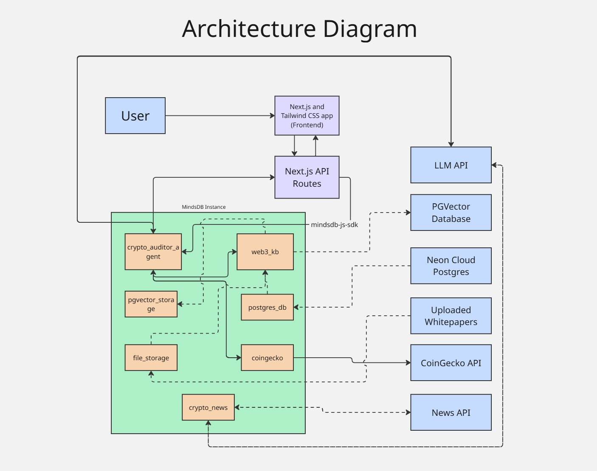

# Crypto Protocol Auditor

The Web3 world is exploding. New protocols launch daily, each with a dense, complex, and often boring whitepaper. For an investor, developer, or enthusiast, trying to find the right sources, understand technical consensus mechanisms, and track market changes is a disconnected nightmare of tabs and data silos. The Crypto Protocol Auditor solves this. It's an AI-powered auditor, built on MindsDB, that unifies this scattered data into one conversational interface. You can instantly feed the system unstructured data like PDF whitepapers and structured data like project info from your database. Immediately, you can ask natural language questions to get simple answers from complex documents, compare the technical specs of multiple protocols side-by-side, and—most powerfully—get a real-time, 360-degree view by asking for live price activity from CoinGecko and current market sentiment from live news articles, all in one place.

---

## 📚 Documentation

- **[KB_EVALUATION.md](./KB_EVALUATION.md)** - Knowledge base evaluation & metrics
- **[ROADMAP.md](./ROADMAP.md)** - Feature roadmap & development plan

---

## 🎯 What It Does

**Hybrid Search** combines knowledge base, live prices, and sentiment analysis in one query:
- 📚 **Knowledge Base**: Provide as much documents and cryptocurrency data as you want
- 💰 **Live Prices**: Real-time market data (price, market cap, 24h change)
- 📈 **Sentiment Analysis**: Market mood (bullish/bearish/neutral) from latest news and link to the most relevant sources/articles
- 🔀 **Protocol Comparison**: Side-by-side analysis of 2-5 protocols

---

## ✨ Features

✅ **AI-Powered Search**
- Hybrid search: semantic + keyword combining
- Auto-classification: KB-only, prices-only, or combined queries
- Query timing metrics (KB ms, price ms, total ms)

✅ **Real-Time Market Data**
- Live prices (configurable source, e.g., CoinGecko)
- Market cap, volume, 24h/7d price changes
- Intelligent caching for performance

✅ **Sentiment & News Intelligence**
- AI sentiment analysis (configurable LLM)
- Recent articles with sources and dates
- Bullish/bearish/neutral confidence scores

✅ **Protocol Comparison**
- Compare 2-5 protocols side-by-side
- Combined technical info + live prices + sentiment
- AI-generated comparison summaries

✅ **Modern UI**
- Dark theme with fintech design tokens
- Responsive cards for desktop & mobile
- Loading states and error handling

---

## 🏗️ System Architecture



### Architecture Overview

**Zone 1: Frontend (User Layer)**
- Next.js + React with TypeScript
- Dark theme UI (responsive)
- Real-time search, comparison, and sentiment displays

**Zone 2: Backend (API Routes)**
- `/api/agent/query` - Main orchestrator (hybrid search)
- `/api/sentiment` - Market sentiment analysis
- `/api/compare` - Protocol comparison
- `/api/prices` - Live pricing (cached)
- `/api/search` - Direct KB search

**Zone 3: MindsDB (AI Brain)**
- Agent engine (connects to your LLM provider)
- Knowledge base (112+ documents via PGVector embeddings)
- News database for sentiment analysis
- Multi-source data integration

**Zone 4: Data Layer**
- Vector database (PGVector embeddings)
- Price source (e.g., CoinGecko, Binance)
- News source (e.g., NewsAPI)
- Metadata storage (e.g., Neon Postgres)

---

## 📁 Project Structure

```
crypto-protocol-auditor/
├── crypto-auditor-app/           # Next.js frontend + API routes
│   ├── app/
│   │   ├── page.tsx              # Main search UI
│   │   ├── layout.tsx            # Root layout
│   │   ├── globals.css           # Global styles
│   │   ├── compare/
│   │   │   └── page.tsx          # Protocol comparison page
│   │   └── api/
│   │       ├── agent/query       # Hybrid search orchestration
│   │       ├── prices/           # Live prices endpoint
│   │       ├── sentiment/        # Sentiment analysis endpoint
│   │       ├── compare/          # Protocol comparison endpoint
│   │       └── search/           # Direct KB search endpoint
│   └── package.json
├── docker-compose.yml             # MindsDB + PGVector services
├── crypto_auditor_architecture.jpg # System architecture diagram
├── kb_evaluate.py                 # KB evaluation tool
├── advanced_kb_evaluate.py        # Advanced metrics tool
├── KB_EVALUATION.md               # KB evaluation guide
├── ROADMAP.md                    # Feature roadmap
└── .env.example                  # Environment variables template
```

---

## 🚀 Getting Started

### Prerequisites

- **Node.js** 18+
- **Docker** & **Docker Compose**
- **Basic MindsDB knowledge** - Familiarity with MindsDB agents and databases recommended
- **API Keys** (get free from your chosen providers):
  - LLM provider (e.g., Google Gemini, OpenAI, Anthropic)

### Quick Setup

1. **Clone the repository**
```bash
git clone https://github.com/ritoban23/crypto-protocol-auditor.git
cd crypto-protocol-auditor
```

2. **Configure environment variables**
```bash
cp .env.example .env
# Edit .env with YOUR API keys
```

3. **Install dependencies**
```bash
cd crypto-auditor-app
npm install
cd ..
```

4. **Start services**
```bash
docker-compose up -d
```

5. **Run the application**
```bash
cd crypto-auditor-app
npm run dev
```

Visit http://localhost:3000

---

## 📊 API Reference

### Main Query Endpoint
**POST** `/api/agent/query`

Combines KB search, prices, and sentiment:
```json
{
  "query": "Tell me about Bitcoin"
}
```

Response includes technical content, market data, and sentiment.

### Other Endpoints
- **GET** `/api/sentiment?project={name}` - Market sentiment analysis
- **POST** `/api/compare` - Compare multiple protocols
- **GET** `/api/prices?projects={list}` - Live pricing data
- **GET** `/api/search?q={query}` - Direct knowledge base search

---

## ⚙️ Configuration

Customize for your setup:

- **LLM Provider**: Configure in MindsDB (Gemini, OpenAI, etc.)
- **Price Source**: Change API provider (CoinGecko, Binance, etc.)
- **News Source**: Update news API (NewsAPI, etc.)
- **Knowledge Base**: Add/modify documents in MindsDB
- **UI Styling**: Modify CSS variables in `globals.css`

---

## 📈 Performance

| Operation | Time | Details |
|-----------|------|---------|
| KB search | 200-500ms | Semantic + keyword |
| Price fetch | 50-900ms | Depends on external API |
| Sentiment (first) | 2-5s | News + AI analysis |
| Sentiment (cached) | <100ms | Configurable TTL |
| Combined query | 8-16s | Parallel execution |

---

## 🤝 Contributing

1. Fork the repository
2. Create a feature branch: `git checkout -b feature/my-feature`
3. Commit changes: `git commit -m 'Add feature'`
4. Push: `git push origin feature/my-feature`
5. Open a pull request

---


