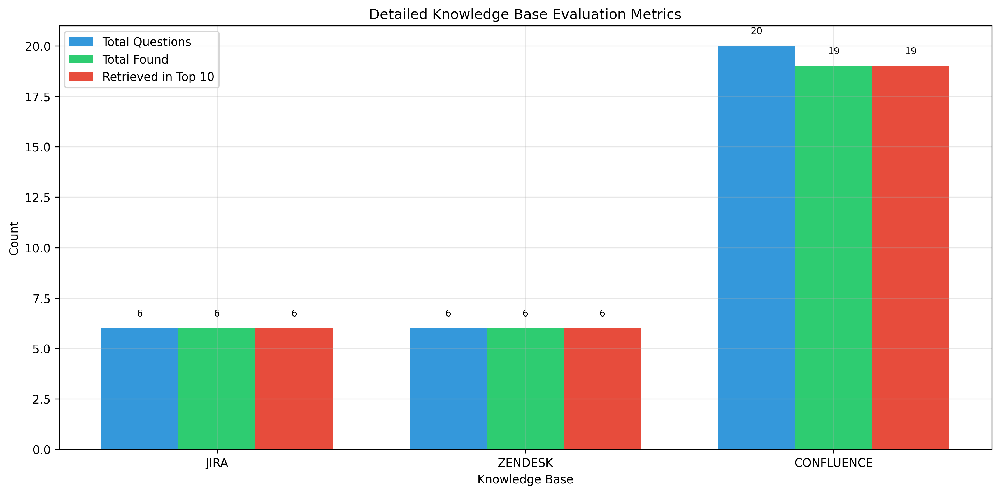
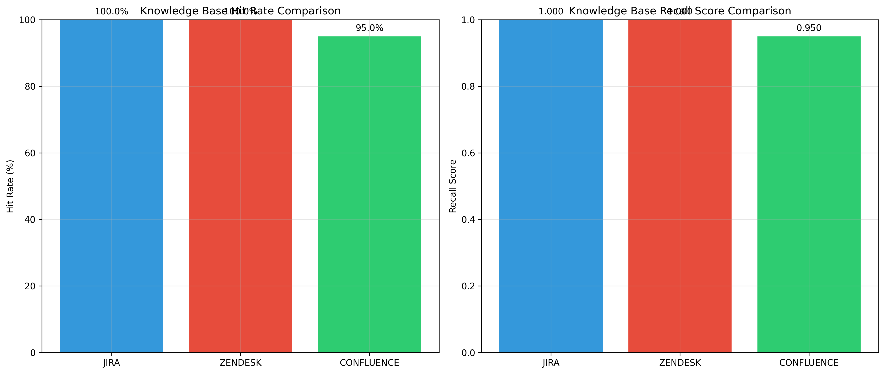
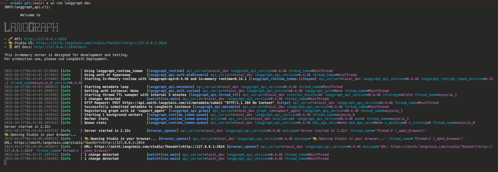
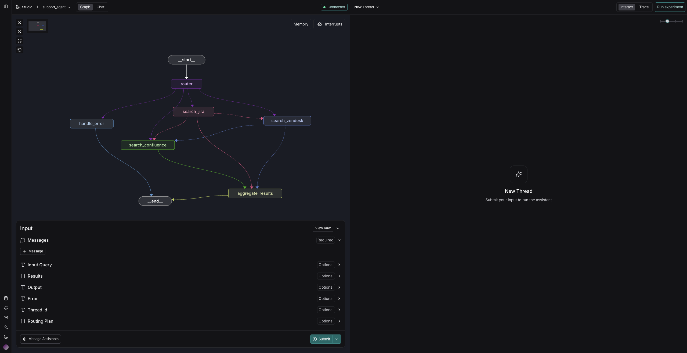
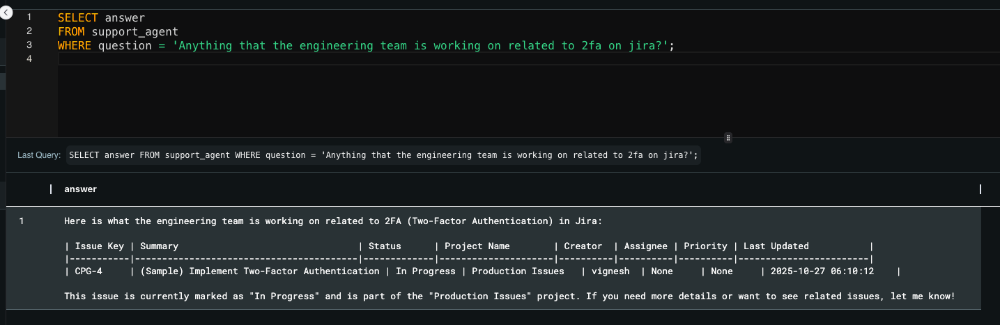

# Area51 - Unified Enterprise Knowledge Search

A production-ready AI-powered search system that unifies Zendesk tickets, Jira issues, and Confluence documentation into a single semantic search interface. Built with MindsDB Knowledge Bases for intelligent, context-aware discovery across all your enterprise knowledge sources.

> **Quick Start**: See [QUICKSTART.md](QUICKSTART.md) for immediate setup instructions.

## Demo

**[▶️ Watch the Demo Video](https://drive.google.com/file/d/1EYNMn29d0b2iaXA4EZxH6zRS78ErA1fF/view)**

## Featured

- **Blog Post**: [Unifying Enterprise Knowledge Search with MindsDB](https://dev.to/prasanna_fdb846e8c3a99074/unifying-enterprise-knowledge-search-with-mindsdb-2cho)
- **LinkedIn**: [Project Announcement](https://www.linkedin.com/posts/prasanna-saravanan_we-came-acrossmindsdb-and-it-instantly-activity-7388639910221688832-3TKx?utm_source=share&utm_medium=member_desktop&rcm=ACoAADNOdxgBTYgSHinrZ9jyC5mE8zRGfUl2RJ0)

## Problem Statement

Modern enterprises battle knowledge fragmentation every day. Critical information is scattered across three distinct platforms:

- **Zendesk**: Customer support tickets, resolutions, and interaction history
- **Jira**: Engineering issues, bug reports, and project tracking
- **Confluence**: Technical documentation, SOPs, and internal guides

This fragmentation creates real operational costs. Support agents waste 20+ minutes per ticket switching between systems, trying to piece together context that exists but isn't discoverable. An engineer investigating a bug can't easily see customer impact. Documentation teams operate blind to actual support needs.

The result: slower resolutions, duplicated effort, and knowledge that never reaches the people who need it.

Area51 solves this by creating a unified semantic search layer that understands relationships and context across all three platforms simultaneously.

## Architecture

Area51 integrates Zendesk, Jira, and Confluence through MindsDB Knowledge Bases, using hybrid semantic search to provide intelligent results across all sources.


### Core Components

**Data Integration Layer**
- Three MindsDB datasources connecting directly to Zendesk, Jira, and Confluence APIs
- Automatic authentication, pagination, and rate limiting handled by MindsDB connectors
- No custom ETL code required

**Knowledge Base Layer**
- Three separate knowledge bases indexed with Azure OpenAI embeddings
- Automatic chunking and embedding generation
- pgvector storage for fast similarity search

**Automation Layer**
- Scheduled MindsDB jobs refresh each knowledge base incrementally
- Zendesk KB updates hourly
- Jira KB updates every 30 minutes  
- Confluence KB updates every 6 hours
- No separate orchestration infrastructure needed

**Query Layer**
Three agent interfaces providing different interaction models:
- **LangGraph Agent**: Conversational, multi-turn reasoning for complex queries
- **MindsDB SQL Agent**: High-performance direct queries for dashboards and automation
- **MCP Server**: Integration with AI assistants like Claude Desktop

**Evaluation Framework**
Built-in MindsDB evaluation metrics track search performance continuously:
- Hit rate at K (H@1, H@5, H@10)
- Mean Reciprocal Rank (MRR)
- Cumulative recall
- Query latency

## Knowledge Base Schema

Each knowledge base follows a consistent schema that combines semantic search with structured metadata filtering.

### Zendesk Knowledge Base

**Storage**: pgvector with Azure OpenAI embeddings

| Field | Description |
|-------|-------------|
| `id` | Unique ticket identifier |
| `subject` | Ticket subject line |
| `description` | Ticket description content |
| `priority` | Ticket priority level |
| `status` | Current ticket status |
| `assignee_id` | Assigned user ID |
| `requester_id` | Requesting user ID |
| `brand_id` | Associated brand ID |
| `created_at` | Ticket creation timestamp |
| `updated_at` | Last update timestamp |
| `type` | Ticket type classification |
| `tags` | Associated tags |
| `url` | Ticket web URL |
| `organization_id` | Related organization ID |
| `group_id` | Support group ID |
| `due_at` | Due date timestamp |
| `custom_fields` | Custom field values |
| `satisfaction_rating.score` | Customer satisfaction rating |

### Jira Knowledge Base

| Field | Description |
|-------|-------------|
| `id` | Issue identifier |
| `key` | Issue key (e.g., PROJ-123) |
| `project_id` | Project identifier |
| `project_key` | Project key code |
| `project_name` | Project display name |
| `summary` | Issue summary title |
| `description` | Issue description |
| `priority` | Priority level |
| `creator` | Creator username |
| `assignee` | Assignee username |
| `status` | Current status |

### Confluence Knowledge Base

| Field | Description |
|-------|-------------|
| `id` | Page identifier |
| `status` | Page status |
| `title` | Page title |
| `spaceId` | Space identifier |
| `authorId` | Author user ID |
| `ownerId` | Owner user ID |
| `createdAt` | Creation timestamp |
| `body_storage_value` | Page content |
| `version_number` | Version number |
| `_links_webui` | Web UI link |

## SQL Examples

### Semantic Search

Find relevant tickets using natural language understanding:

```sql
SELECT *
FROM confluence_kb
WHERE content = 'docker'
ORDER BY relevance DESC
LIMIT 5;
```

The semantic search understands that "docker" relates to "open source hosting" without requiring exact keyword matches.

### Structured Filtering

Query specific metadata fields for precise results:

```sql
SELECT 
    *
FROM jira_kb
WHERE status = 'In Progress';
```

### Hybrid Search

Combine semantic understanding with structured metadata filters:

```sql
SELECT *
FROM zendesk_kb
WHERE content = '2fa'
and hybrid_search=true
and hybrid_search_alpha=0.6
LIMIT 10;
```

This query semantically searches for 2fa-related content while simultaneously filtering by while using hybrid search functionality of mindsDb.


### Scheduled Refresh Jobs

Keep knowledge bases current with automatic incremental updates:

```sql
CREATE JOB jira_refresh_job (
    insert into jira_kb
    select * from jira_datasource.issues;
) EVERY hour;
```

### Evaluation Metrics

Monitor search quality continuously:

```sql
EVALUATE KNOWLEDGE_BASE confluence_kb
USING 
    test_table = 'pgvector_datasource.confluence_test_table',
    version = 'doc_id',
    generate_data = false,
    evaluate = true;

```

Returns comprehensive metrics including Hit@1, Hit@5, Hit@10, MRR, and recall scores.

## Performance Metrics

Area51 achieves strong performance across all three knowledge bases with sub-second query times and high relevance.

| Knowledge Base | Hit Rate | Recall Score | Avg Query Time |
|----------------|----------|--------------|----------------|
| Confluence KB  | 94.0%    | 0.940        | 0.15s         |

### Detailed Evaluation Results

The evaluation framework generates comprehensive metrics showing retrieval performance across different query types and confidence thresholds.



### Comparative Analysis

Side-by-side comparison of knowledge base performance across multiple evaluation dimensions.



Metrics are generated using MindsDB's built-in evaluation framework, which calculates hit rates, cumulative recall, and mean reciprocal rank. The system auto-generates test questions from knowledge base content for continuous quality monitoring.


## Setup

### Prerequisites

- Docker and Docker Compose
- Python 3.10+
- Azure OpenAI API key
- Zendesk API credentials
- Jira API credentials
- Confluence API credentials

### Installation

For detailed installation instructions, see [QUICKSTART.md](QUICKSTART.md).


## Usage

### LangGraph Conversational Agent

The LangGraph agent provides a visual development interface and conversational interaction with your knowledge bases through an intelligent routing system.

**Starting the LangGraph Server**

Launch the LangGraph development server:

```bash
uv run langgraph dev
```

The server will start on `http://127.0.0.1:2024` and automatically open LangChain Studio in your browser.

Server output:
```
LANGGRAPH

API: http://127.0.0.1:2024
Studio UI: https://smith.langchain.com/studio/?baseUrl=http://127.0.0.1:2024
API Docs: http://127.0.0.1:2024/docs

Registering graph with id 'support_agent'
Server started in 2.32s
Opening Studio in your browser...
```

**Graph Architecture**

The support_agent graph uses intelligent routing to search across all knowledge bases:

1. **Router** - Analyzes the user's query and determines which systems to search
2. **Search Nodes** - Three parallel search operations:
   - `search_jira` - Search Jira issues
   - `search_zendesk` - Search Zendesk tickets  
   - `search_confluence` - Search Confluence documentation
3. **Aggregate Results** - Synthesizes findings from all searches into a unified response
4. **Error Handling** - Manages failures gracefully



**Using LangGraph Studio**

1. The Studio UI opens automatically showing the graph visualization
2. Click the "Chat" tab to interact with the agent
3. Type your query in the input field (e.g., "401 errors on payment API")
4. The agent routes your query to relevant knowledge bases
5. Returns synthesized results with context from Jira, Zendesk, and Confluence



**Example Interaction**

Query: "authentication failures on payment API"

Agent Response:
```
Found 15 similar tickets in Zendesk with 401 errors. Most common resolution 
is customers using sandbox keys in production environment. The "API 
Authentication Troubleshooting Guide" in Confluence has a dedicated section 
on this with debugging steps. See resolved ticket ZD-1247 for a similar case 
that was resolved in 5 minutes.
```

**API Access**

You can also interact with the agent programmatically via the REST API:

```python
import requests

response = requests.post(
    'http://127.0.0.1:2024/runs',
    json={
        'assistant_id': 'support_agent',
        'input': {'messages': [{'role': 'user', 'content': '401 errors on API'}]}
    }
)
```

**Debugging & Monitoring**

Use the "Trace" button in Studio to inspect the execution flow through each node, making it easy to debug routing decisions and understand how queries are processed.

The Studio interface provides real-time visibility into:
- Which knowledge bases are being queried
- Response confidence scores
- Error paths and fallback handling
- Thread state and conversation context

### MindsDB SQL Agent

The MindsDB SQL agent provides a high-performance interface for direct queries to your knowledge bases. It's automatically created during setup and accessible through both the MindsDB Studio UI and the SDK.

**Using MindsDB Studio UI**

1. Access the MindsDB Studio at `http://localhost:47334`
2. Navigate to the SQL Editor
3. Query the support_agent using natural language questions:

```sql
SELECT answer
FROM support_agent
WHERE question = 'Anything that the engineering team is working on related to 2fa on jira?';
```

The agent understands your question semantically and returns relevant results from all knowledge bases, automatically routing to Jira, Zendesk, or Confluence as needed.



**Example Query**

Query:
```sql
SELECT answer
FROM support_agent
WHERE question = 'Anything that the engineering team is working on related to 2fa on jira?';
```

Response:
```
Here is what the engineering team is working on related to 2FA (Two-Factor Authentication) in Jira:

[Summary of Jira issues returned in tabular format with Issue Key, Summary, Status, Project Name, etc.]

This issue is currently marked as "In Progress" and is part of the "Production Issues" project. 
If you need more details or want to see related issues, let me know!
```

**Direct Knowledge Base Queries**

You can also query knowledge bases directly using MindsDB SDK:

```python
import mindsdb_sdk

server = mindsdb_sdk.connect('http://localhost:47334')
project = server.projects.list()[0]
kb = project.knowledge_bases['zendesk_kb']

# Execute semantic search
results = kb.search('payment errors', limit=10)
```

**Semantic Search Queries**

Query knowledge bases semantically using SQL:

```sql
SELECT 
    ticket_id,
    title,
    description,
    confidence_score
FROM zendesk_kb
WHERE text MATCHES 'authentication errors payment API'
ORDER BY confidence_score DESC
LIMIT 5;
```

### MCP Server

The MCP (Model Context Protocol) server enables AI assistants like Cursor and Claude Desktop to search across all knowledge bases through natural conversation.

**Starting the Server**

Launch the FastMCP server with Server-Sent Events (SSE) transport:

```bash
uv run fastmcp run server.py --transport=sse
```

The server will start on `http://127.0.0.1:5000/sse` with the name "Support Agent Assistant".

Server output:
```
FastMCP 2.0
Server: Support Agent Assistant
Transport: sse
URL: http://127.0.0.1:5000/sse
FastMCP version: 2.12.5
MCP SDK version: 1.16.0
```

**Available Tools**

The MCP server exposes these tools for AI assistants:
- `search_zendesk` - Search Zendesk tickets semantically
- `search_jira` - Search Jira issues semantically
- `search_confluence` - Search Confluence documentation
- `search_all` - Unified search across all knowledge bases
- `evaluate_kb` - Get evaluation metrics for a knowledge base

**Configure Cursor**

To use Area51's MCP server in Cursor:

1. Open Cursor settings (Cmd/Ctrl + ,)
2. Navigate to "Features" → "MCP Servers"
3. Add a new MCP server configuration:

```json
{
  "mcpServers": {
    "area51-support-agent": {
      "command": "uv",
      "args": ["run", "fastmcp", "run", "/path/to/area51/server.py", "--transport=sse"],
      "env": {
        "MINDSDB_URL": "http://localhost:47334"
      }
    }
  }
}
```

4. Update the path to match your Area51 installation
5. Restart Cursor

Once configured, you can ask Cursor: "Search for authentication errors in Zendesk" and it will use the MCP server to query your knowledge bases.


**Session Management**

The server uses session IDs for maintaining conversation context. Each interaction creates a session that persists throughout the conversation. Session IDs are automatically generated and managed by the server.

**Alternative: Claude Desktop Configuration**

For Claude Desktop, configure in `~/.claude_desktop_config.json`:

```json
{
  "mcpServers": {
    "area51": {
      "command": "uv",
      "args": ["run", "fastmcp", "run", "server.py", "--transport=sse"]
    }
  }
}
```

**Documentation**

Full MCP configuration details: https://gofastmcp.com

## Why MindsDB

Traditional RAG systems require stitching together multiple components:
- Vector database (Pinecone/Weaviate/PgVector)
- Custom ETL pipelines per source
- Embedding service management
- Job orchestration (Airflow/Kubernetes)
- Custom evaluation framework

MindsDB consolidates this into a single SQL-native platform. Creating a knowledge base requires one `CREATE KNOWLEDGE_BASE` statement. Scheduling incremental updates is a `CREATE JOB` statement. Evaluation is a single `EVALUATE` command.

The result: a production-ready, multi-source RAG system built in days instead of months, with orders of magnitude less code to maintain.


## Project Structure

```
area51/
├── agent.py                 # LangGraph conversational agent
├── server.py                # MCP server for AI assistants
├── server_langgraph.py      # LangGraph server implementation
├── setup.py                 # Automated setup and configuration
├── langgraph.json           # LangGraph configuration
├── pyproject.toml           # Project dependencies
├── uv.lock                  # Dependency lockfile
├── docker-compose.yml       # MindsDB and PostgreSQL containers
├── Dockerfile               # Custom MindsDB image
├── integrations/            # Platform API clients
│   ├── zendesk_client.py
│   ├── jira_client.py
│   └── confluence_client.py
├── models/                  # Data models
│   ├── zendesk_ticket.py
│   ├── jira_issue.py
│   ├── confluence_page.py
│   └── common.py
├── tools/                   # Search and analysis tools
│   └── search.py
├── utils/                   # Utility scripts
│   ├── setup_kb.py
│   ├── setup_datasource.py
│   ├── setup_jobs.py
│   ├── populate_data.py
│   ├── evaluate_kb.py
│   └── create_test_tables.py
├── tests/                   # Test suite
│   ├── data/                # Test data files
│   ├── test_evaluation.py
│   ├── test_hybrid_search.py
│   └── test_with_real_data.py
├── evaluation_charts/       # Performance metrics
├── architecture/            # Architecture diagrams
├── README.md                # Project documentation
└── USECASE.md               # Use case scenarios
```

## Contributing

This project was built for Hacktoberfest 2025. Contributions welcome.

## Authors

Built by the Area51 team.
@vaarshha @vigbav36 @prasnna-saravanan 
