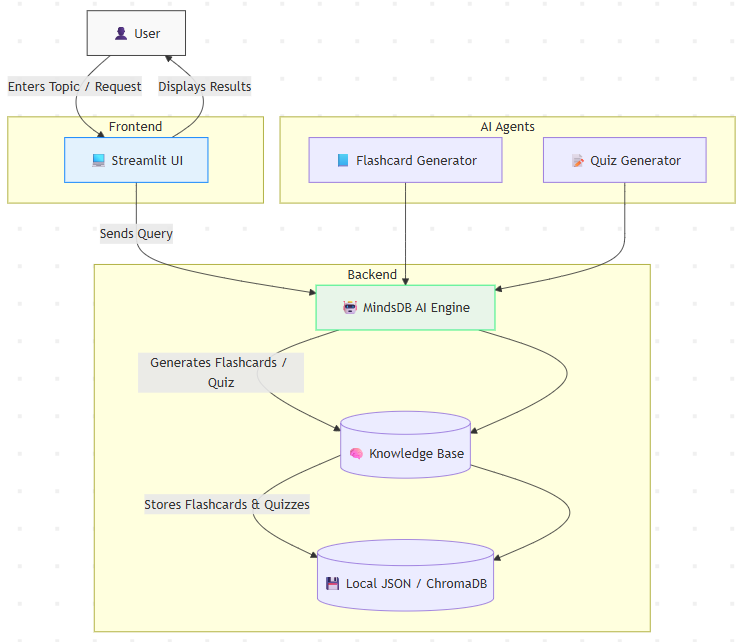

# ⚡ **MindSpark AI**

**MindSpark AI** is an intelligent learning assistant that transforms how you study.  
It generates AI-powered flashcards and dynamic quizzes on any topic in seconds — helping learners, educators, and professionals retain knowledge smarter and faster.  
Built with **Streamlit** and **MindsDB**, MindSpark AI merges simplicity with intelligence.

---

## 🎯 Use Case

Traditional studying methods are often time-consuming and static.  
MindSpark AI automates the learning lifecycle:

- Learners enter any topic (e.g., "Neural Networks" or "World War II").
- The system instantly generates interactive flashcards and quizzes powered by AI.
- Knowledge is stored, searchable, and reusable for consistent revision.
- Admins (or educators) can manage topics and curate the learning experience.

 Result: Personalized learning, better memory retention, and adaptive AI-driven insights.

---

## ✨ Features

### 🧠 Flashcard Generator
- Instantly create topic-based flashcards with AI.
- Flip animations for a modern, engaging experience.
- Save and manage flashcards in your Knowledge Base.

### 🧩 Quiz Creator
- Auto-generate multiple-choice questions (MCQs).
- See instant correct answers and explanations.
- Review quizzes for better understanding.

### 📊 Knowledge Base
- Store and manage all topics in one place.
- Delete, view, or explore previous AI-generated content.
- Organize by subject or difficulty.

### 🎨 Modern Streamlit UI
- Animated layout with smooth transitions.
- Easy navigation between Home, Flashcards, and Quiz.
- Responsive design for desktop and tablet users.

### 🤖 AI Engine
MindSpark AI uses MindsDB as its AI intelligence layer to:
- Generate accurate, context-aware flashcards.
- Produce structured quizzes with correct answers.
- Learn from user inputs to refine topic quality over time.

---

## Technology

- [Python](https://www.python.org/) (Best Programming Language :P)
- [Streamlit](https://streamlit.io/) (UI Library)
- [MindsDB](https://mindsdb.com/) (AI and KB Layer)
- [ChromaDB](https://www.trychroma.com/) (Vector DB)
- [Nebius](https://nebius.com/) (For LLM and Embedding model)

---

## 🧠 Architecture



---

## 📚 Knowledge Base Schema

Name: `flashcards_kb`

```
content_columns = ["topic", "question", "answer"]
metadata_columns = ["type", "difficulty", "category"]
id_column = "id"
```
---

### Knowledge Base Evaluation metrics

| avg_relevancy | avg_relevance_score_by_k | avg_first_relevant_position | mean_mrr | hit_at_k | bin_precision_at_k | avg_entropy | avg_ndcg | avg_query_time | id  | name | created_at |
| ------------- | ------------------------ | --------------------------- | -------- | -------- | ------------------ | ----------- | -------- | -------------- | --- | ---- | ---------- |
| 0.627670248101896 | [1,1,0.92,0.92,0.68,0.35,0.36,0.34,0.35,0.35] | 0 | 1 | [1,1,1,1,1,1,1,1,1,1] | [1,1,0.97,0.95,0.87,0.76,0.68,0.62,0.57,0.55] | 2.1442872927798353 | 0.9992926259506063 | 2.928334045410156 | 1761660056 | my_kb3 | 2025-10-28 14:00:56.438344 |

---


## ⚙️ Installation

Follow these steps to set up and run **MindSpark AI** locally:

---

### 🧩 1. Clone the GitHub Repository
```bash
git clone https://github.com/yourusername/mindspark-ai.git
cd mindspark-ai
```
---

### 🧱 2. Create a Virtual Environment

```bash
python -m venv .venv
```
---

Activate the environment:

- On Windows:
```bash
.venv\Scripts\activate
```
- On Linux / Mac:

```bash
source .venv/bin/activate
```

---

### 📦 3. Install Dependencies
```bash
pip install -r requirements.txt
```

---

###  4. Setup project, environment variables and run setup script
```bash
uv sync

cp .env.example .env # add your nebius api key from nebius ai cloud to NEBIUS_API_KEY var

uv run setup.py
```
---

### 🚀 5. Run the Streamlit App

```bash
streamlit run app.py
```

---
## Blog
https://dev.to/debasis_panda_31e768f5e44/building-mindspark-ai-the-future-of-smart-learning-with-flashcards-and-quizzes-4gp1

## Linkdin
https://www.linkedin.com/posts/debasis-panda-07b2912a5_github-guddu-debasismindspark-ai-activity-7388965772624277504-8D6N?utm_source=share&utm_medium=member_desktop&rcm=ACoAAEmLyB8B76-Ngv9FF5gbE3jSxNk-L0kQ9Rk

## X
https://x.com/DebasisPan54565/status/1983132238007894480


## 🎬 Demo Video  
[![Watch on X]](https://x.com/DebasisPan54565/status/1983194370171121886?t=nY5EfeqU88pFuD9dmQU8aA&s=19)

## Author

Built with 💖 by [DebasisPanda](https://github.com/guddu-debasis)