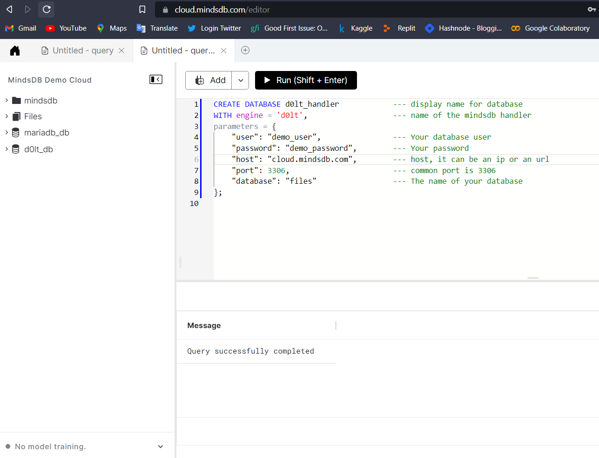
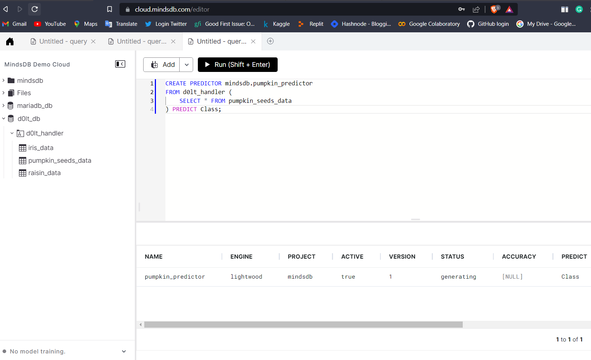

# Welcome to the MindsDB Manual QA Testing for DoIt Handler

> **Please submit your PR in the following format after the underline below `Results` section. Don't forget to add an underline after adding your changes i.e., at the end of your `Results` section.**

## Testing DoIt Handler with [Pumpkin Seeds Dataset](https://www.kaggle.com/datasets/muratkokludataset/pumpkin-seeds-dataset)

**1. Testing CREATE DATABASE**

```sql
CREATE DATABASE d0lt_handler            --- display name for database
WITH engine = 'd0lt',                   --- name of the mindsdb handler 
parameters = {
    "user": "demo_user",                --- Your database user
    "password": "demo_password",        --- Your password
    "host": "cloud.mindsdb.com",        --- host, it can be an ip or an url
    "port": 3306,                       --- common port is 3306
    "database": "files"                 --- The name of your database
};
```



**2. Testing CREATE PREDICTOR**

```sql
CREATE PREDICTOR mindsdb.pumpkin_predictor
FROM d0lt_handler (
    SELECT * FROM pumpkin_seeds_data
) PREDICT Class;
```



**3. Testing SELECT FROM PREDICTOR**

```sql
SELECT * 
FROM mindsdb.models
WHERE name='pumpkin_predictor';
```


### Results

Drop a remark based on your observation.
- [x] Works Great 💚 (This means that all the steps were executed successfuly and the expected outputs were returned.

---
