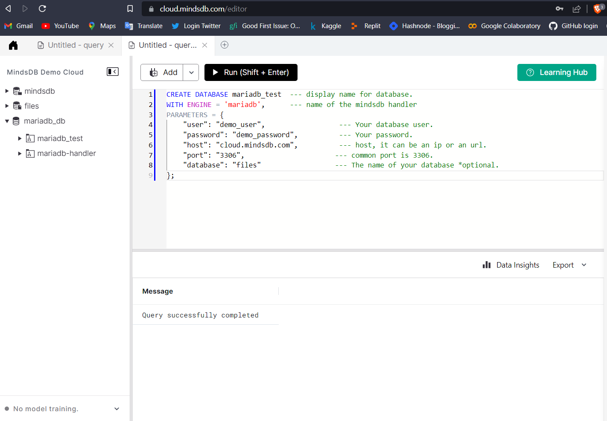
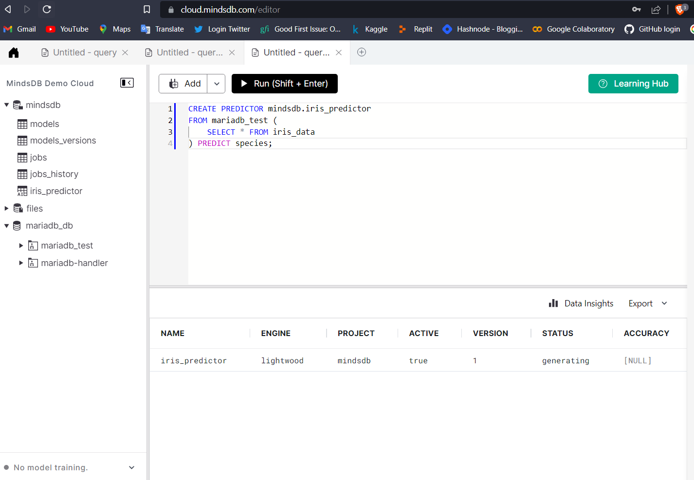
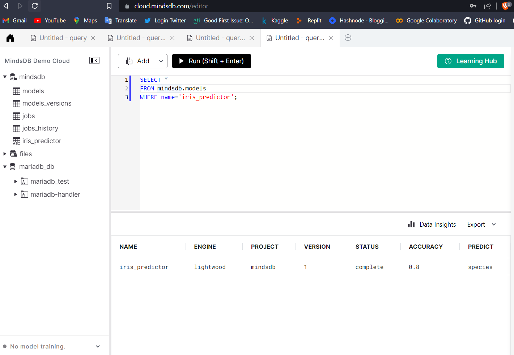
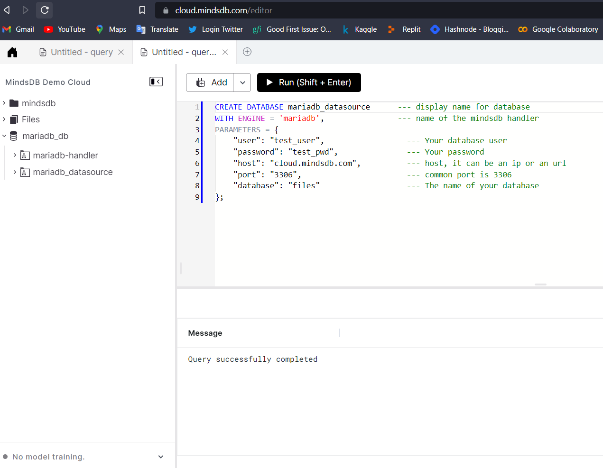
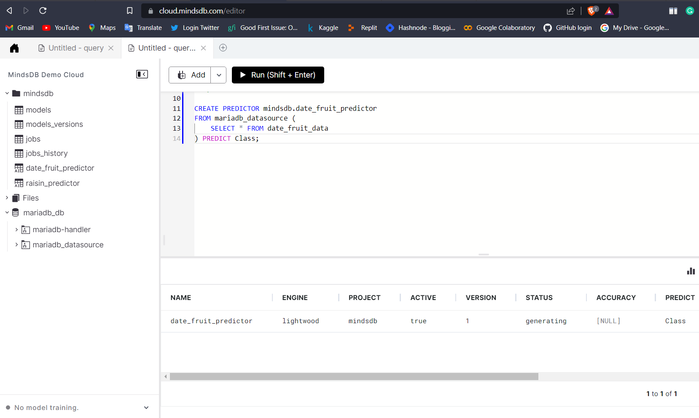
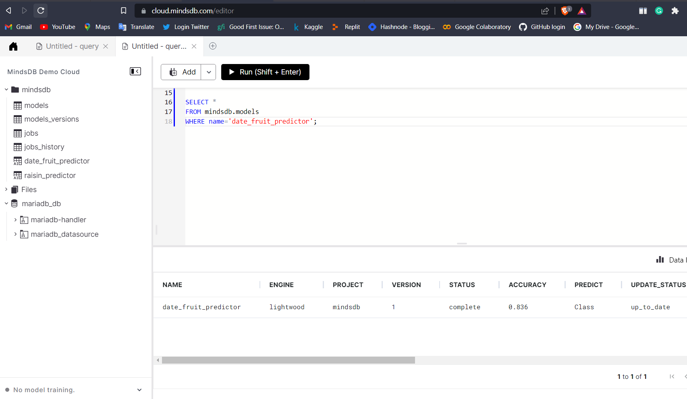
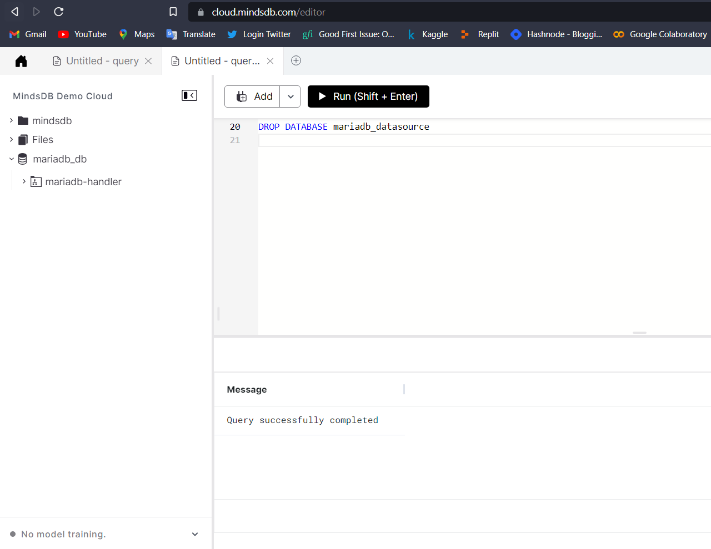

# Welcome to the MindsDB Manual QA Testing for MariaDB Handler

> **Please submit your PR in the following format after the underline below `Results` section. Don't forget to add an underline after adding your changes i.e., at the end of your `Results` section.**

## Testing MariaDB Handler with [Iris Flower Dataset](https://www.kaggle.com/datasets/arshid/iris-flower-dataset)

**1. Testing CREATE DATABASE**

```sql
CREATE DATABASE mariadb_test  --- display name for database. 
WITH ENGINE = 'mariadb',      --- name of the mindsdb handler 
PARAMETERS = {
    "user": "demo_user",                  --- Your database user.
    "password": "demo_password",          --- Your password.
    "host": "cloud.mindsdb.com",          --- host, it can be an ip or an url. 
    "port": "3306",                      --- common port is 3306.
    "database": "files"                  --- The name of your database *optional.
};
```



**2. Testing CREATE PREDICTOR**

```sql
CREATE PREDICTOR mindsdb.iris_predictor
FROM mariadb_test (
    SELECT * FROM iris_data
) PREDICT species;
```



**3. Testing SELECT FROM PREDICTOR**

```sql
SELECT * 
FROM mindsdb.models
WHERE name='iris_predictor';
```



### Results

Drop a remark based on your observation.
- [X] Works Great 💚 (This means that all the steps were executed successfuly and the expected outputs were returned.)

---

## Testing MariaDB Handler with [Date Fruit Datasets](https://www.kaggle.com/datasets/muratkokludataset/date-fruit-datasets)

**1. Testing CREATE DATABASE**

```sql
CREATE DATABASE mariadb_datasource      --- display name for database 
WITH ENGINE = 'mariadb',                --- name of the mindsdb handler 
PARAMETERS = {
    "user": "test_user",                  --- Your database user
    "password": "test_pwd",               --- Your password
    "host": "cloud.mindsdb.com",          --- host, it can be an ip or an url 
    "port": "3306",                       --- common port is 3306
    "database": "files"                   --- The name of your database
};
```



**2. Testing CREATE PREDICTOR**

```sql
CREATE PREDICTOR mindsdb.date_fruit_predictor
FROM mariadb_datasource (
    SELECT * FROM date_fruit_data
) PREDICT Class;
```



**3. Testing SELECT FROM PREDICTOR**

```sql
SELECT * 
FROM mindsdb.models
WHERE name='date_fruit_predictor';
```



**4. Testing DROP THE DATABASE**

```sql
DROP DATABASE mariadb_datasource;
```




### Results

Drop a remark based on your observation.
- [X] Works Great 💚 (This means that all the steps were executed successfuly and the expected outputs were returned.)
- [x] Made changes as per the related issue [#3908](https://github.com/mindsdb/mindsdb/issues/3908)
