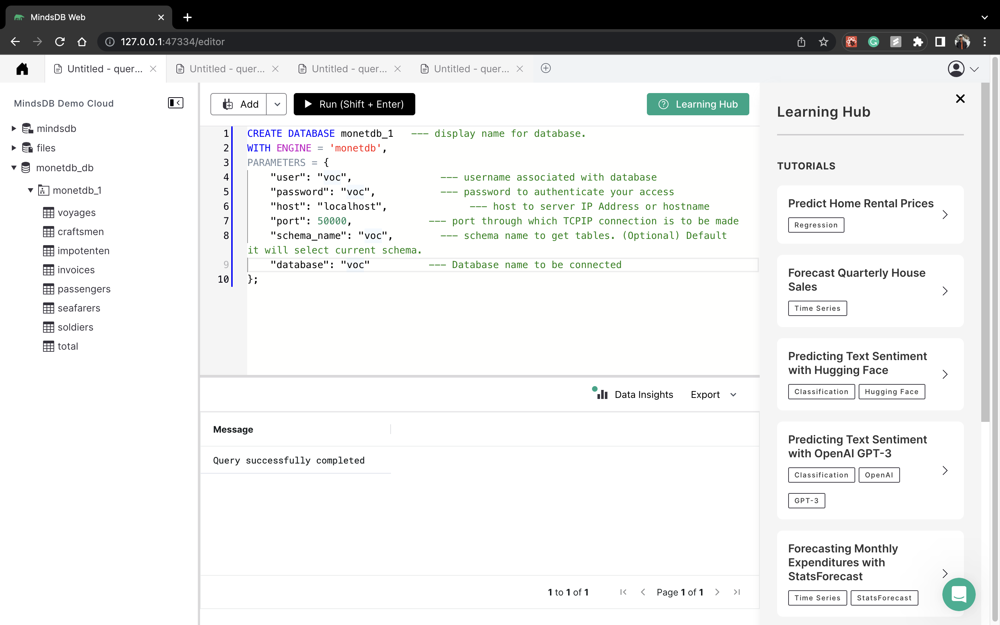
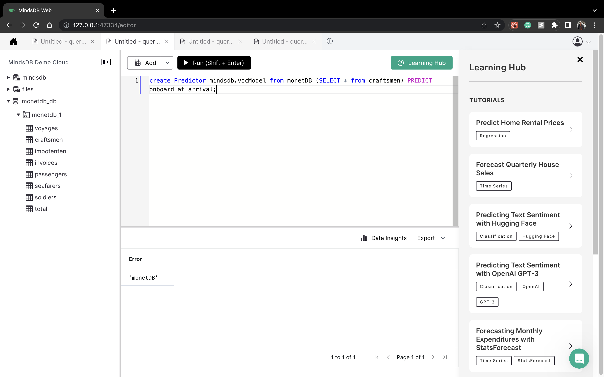

# Welcome to the MindsDB Manual QA Testing for MonetDB Handler

> **Please submit your PR in the following format after the underline below `Results` section. Don't forget to add an underline after adding your changes i.e., at the end of your `Results` section.**

## Testing MonetDB Handler with [Voc Dataset](https://www.monetdb.org/documentation-Sep2022/user-guide/tutorials/voc-tutorial/)

**1. Testing CREATE DATABASE**

```
CREATE DATABASE monetdb_1   --- display name for database.
WITH ENGINE = 'monetdb',
PARAMETERS = {
    "user": "voc",               --- username associated with database
    "password": "voc",           --- password to authenticate your access
    "host": "localhost",              --- host to server IP Address or hostname
    "port": 50000,             --- port through which TCPIP connection is to be made
    "schema_name": "voc",        --- schema name to get tables. (Optional) Default it will select current schema.
    "database": "voc"          --- Database name to be connected
};
```



**2. Testing CREATE PREDICTOR**

```
create Predictor mindsdb.vocModel from monetDB (SELECT * from craftsmen) PREDICT onboard_at_arrival;
```



**3. Testing SELECT FROM PREDICTOR**

```
SELECT *
FROM mindsdb.predictors
WHERE name='vocmodel';
```


### Results

Drop a remark based on your observation.
- [x] Works Great 💚 (This means that all the steps were executed successfuly and the expected outputs were returned.)
- [ ] There's a Bug 🪲 [Issue Title](URL To the Issue you created) ( This means you encountered a Bug. Please open an issue with all the relevant details with the Bug Issue Template)

---