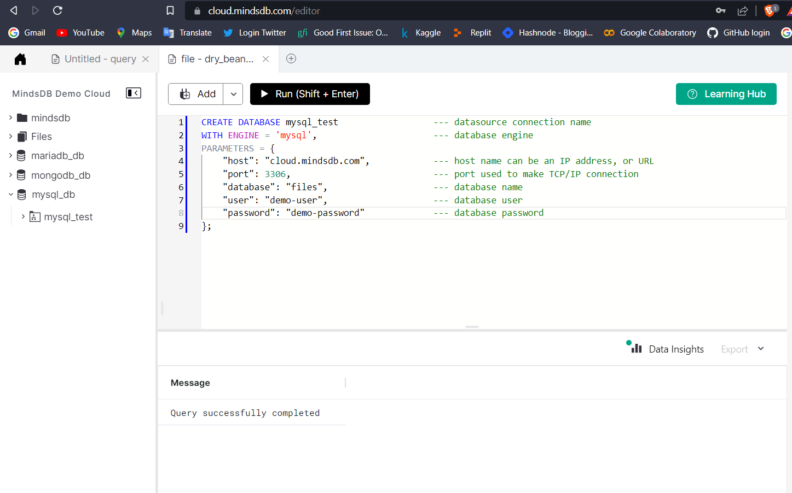
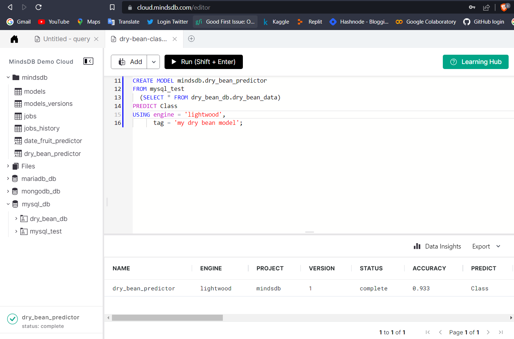
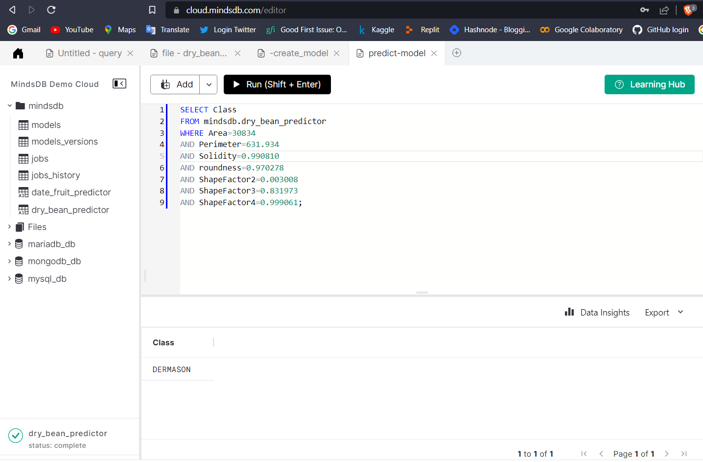
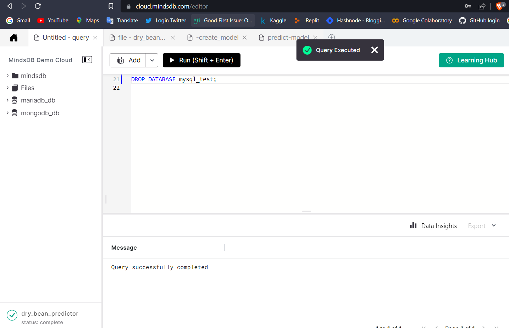

# Welcome to the MindsDB Manual QA Testing for MySQL Handler

> **Please submit your PR in the following format after the underline below `Results` section. Don't forget to add an underline after adding your changes i.e., at the end of your `Results` section.**

## Testing MySQL Handler with [Dry Bean Dataset](https://www.kaggle.com/datasets/muratkokludataset/dry-bean-dataset)

**1. Testing CREATE DATABASE**

```sql
CREATE DATABASE mysql_test                  --- datasource connection name
WITH ENGINE = 'mysql',                      --- database engine
PARAMETERS = {
    "host": "cloud.mindsdb.com",            --- host name can be an IP address, or URL
    "port": 3306,                           --- port used to make TCP/IP connection
    "database": "files",                    --- database name
    "user": "demo-user",                    --- database user
    "password": "demo-password"             --- database password
};
```



**2. Testing CREATE MODEL**

```sql
CREATE MODEL mindsdb.dry_bean_predictor
FROM mysql_test
  (SELECT * FROM dry_bean_data)
PREDICT Class
USING engine = 'lightwood',
      tag = 'my dry bean model';
```



**3. Testing SELECT FROM MODEL**

```sql
SELECT Class
FROM mindsdb.dry_bean_predictor
WHERE Area=30834
AND Perimeter=631.934
AND Solidity=0.990810
AND roundness=0.970278
AND ShapeFactor2=0.003008
AND ShapeFactor3=0.831973
AND ShapeFactor4=0.999061;
```



**4. Testing DROP DATABASE**

```sql
DROP DATABASE mysql_test;
```



### Results

Drop a remark based on your observation.
- [x] Works Great 💚 (This means that all the steps were executed successfuly and the expected outputs were returned.)
- [x] This use-case is made based on **issue [#6219](https://github.com/mindsdb/mindsdb/issues/6219)**  
---


## Testing MySQL Handler with [Predictive Maintenance](https://www.kaggle.com/datasets/tolgadincer/predictive-maintenance?select=train.csv)

**1. Testing CREATE DATABASE**

```
CREATE DATABASE predictMaintenance  
WITH ENGINE = 'mysql',       
PARAMETERS = {
    "user": "root",            
    "password": "armanchand",    
    "host": "0.tcp.in.ngrok.io",             
    "port": "15232",          
    "database": "predicitveMaintenance"          
};

```


**2. Testing CREATE PREDICTOR**

```
CREATE PREDICTOR mindsdb.machine_failure_rate_predicotr
FROM machine_failure                     
(SELECT * FROM machine_train LIMIT 10000)  
PREDICT Machine_failure;    
```


**3. Testing SELECT FROM PREDICTOR**

```
SELECT Machine_failure
FROM mindsdb.machine_failure_rate_predictor
WHERE torque =40;
```


### Results

Drop a remark based on your observation.
- [X] Works Great 💚 (This means that all the steps were executed successfuly and the expected outputs were returned.)
- [ ] There's a Bug 🪲 [Issue Title](URL To the Issue you created) ( This means you encountered a Bug. Please open an issue with all the relevant details with the Bug Issue Template)

---
