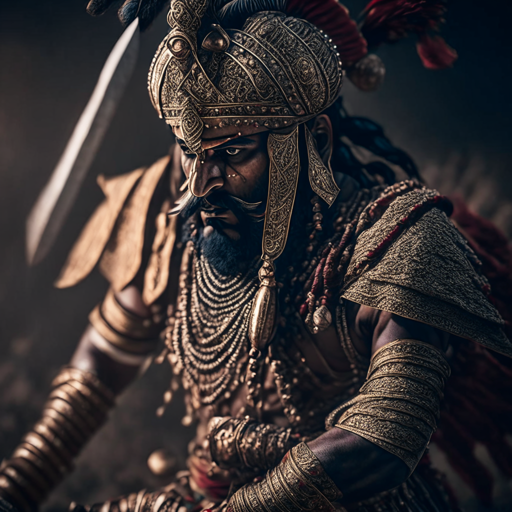

# Welcome to the MindsDB Manual QA Testing for Replicate Handler

> **Please submit your PR in the following format after the underline below `Results` section. Don't forget to add an underline after adding your changes i.e., at the end of your `Results` section.**

## Testing Replicate Handler 

**1. CREATE MODEL**

```sql
CREATE MODEL aiforever
PREDICT url
USING
    engine = 'replicate',
    model_name= 'ai-forever/kandinsky-2',
    version ='601eea49d49003e6ea75a11527209c4f510a93e2112c969d548fbb45b9c4f19f',
    api_key = 'r8_BpOZN..............................';
```

**2. DESCRIBE PREDICTOR to see available parameters**

```sql
DESCRIBE PREDICTOR mindsdb.aiforever.features;
```

```sql
+---------------------+-------------------+--------------------------------------------------------+---------+
| inputs              | default           | description                                            | type    |
+---------------------+-------------------+--------------------------------------------------------+---------+
| width               | 512               | Choose width. Lower the setting if out of memory.      | -       |
| height              | 512               | Choose height. Lower the setting if out of memory.     | -       |
| prompt              | red cat, 4k photo | Input Prompt                                           | string  |
| scheduler           | p_sampler         | Choose a scheduler                                     | -       |
| batch_size          | 1                 | Choose batch size. Lower the setting if out of memory. | -       |
| prior_steps         | 5                 | -                                                      | string  |
| guidance_scale      | 4                 | Scale for classifier-free guidance                     | number  |
| prior_cf_scale      | 4                 | -                                                      | integer |
| num_inference_steps | 50                | Number of denoising steps                              | integer |
+---------------------+-------------------+--------------------------------------------------------+---------+
```

**3. Testing SELECT FROM PREDICTOR**

```sql
SELECT * FROM aiforever
WHERE prompt="Ancient Indian warrior  on a battlefield, wearing full battle gear and turban,strong determined attitude,wizard look, finely detailed outfit and weapon, intricate design and details, ultra-detailed, highest detail quality, ultra-realistic, photography lighting, reflection mapping, photorealistic, cinematic, cinematic noise, movie quality rendering, octane rendering, sharp focus, 8k, depth of field, real shadow, rtx ray tracing lighting,"
USING
scheduler='plms_sampler',
width=1024,
height=1024;
```

```sql
+---------------------------------------------------------------------------------------------+-------------------------------------------------------------------------------------------------------------------------------------------------------------------------------------------------------------------------------------------------------------------------------------------------------------------------------------------------------------------------------------------------------------------------------------+
| url                                                                                         | prompt                                                                                                                                                                                                                                                                                                                                                                                                                              |
+---------------------------------------------------------------------------------------------+-------------------------------------------------------------------------------------------------------------------------------------------------------------------------------------------------------------------------------------------------------------------------------------------------------------------------------------------------------------------------------------------------------------------------------------+
| https://replicate.delivery/pbxt/sToiQh3wQj7pHtURYt1n3k2JdB2mb4ueR265xP4MujhfnJGRA/out_0.png | Ancient Indian warrior  on a battlefield, wearing full battle gear and turban,strong determined attitude,wizard look, finely detailed outfit and weapon, intricate design and details, ultra-detailed, highest detail quality, ultra-realistic, photography lighting, reflection mapping, photorealistic, cinematic, cinematic noise, movie quality rendering, octane rendering, sharp focus, 8k, depth of field, real shadow, rtx ray tracing lighting, |
+---------------------------------------------------------------------------------------------+-------------------------------------------------------------------------------------------------------------------------------------------------------------------------------------------------------------------------------------------------------------------------------------------------------------------------------------------------------------------------------------------------------------------------------------+
```

# TODO


### Results

Drop a remark based on your observation.
- [x] Works Great 💚 (This means that all the steps were executed successfuly and the expected outputs were returned.)
- [] There's a Bug 🪲 [Issue Title](URL To the Issue you created) ( This means you encountered a Bug. Please open an issue with all the relevant details with the Bug Issue Template)

---