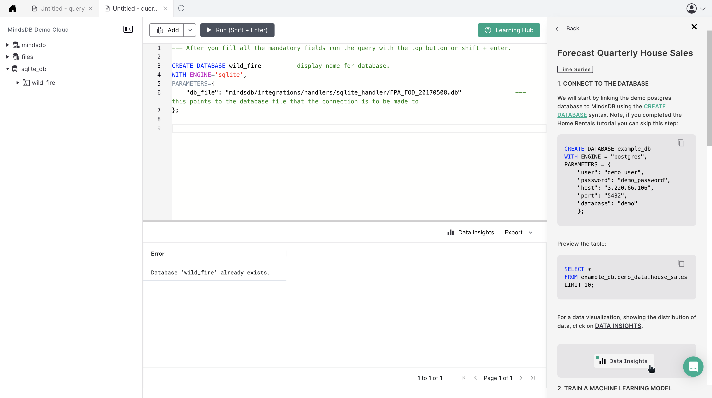
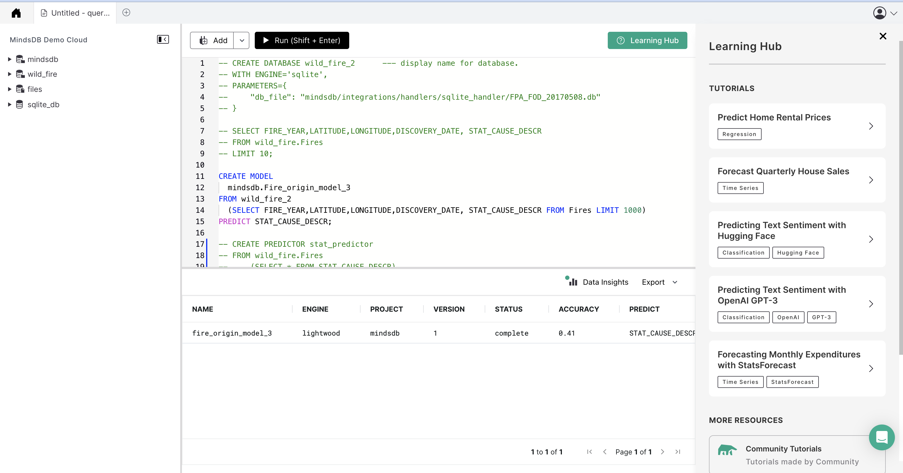
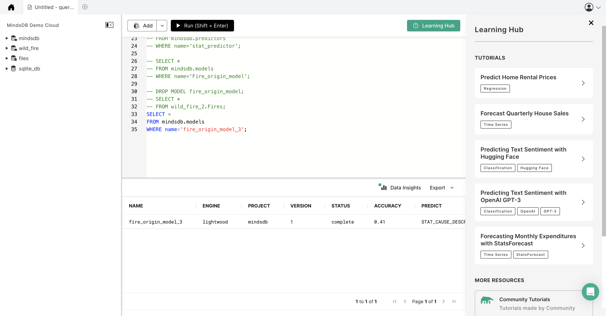
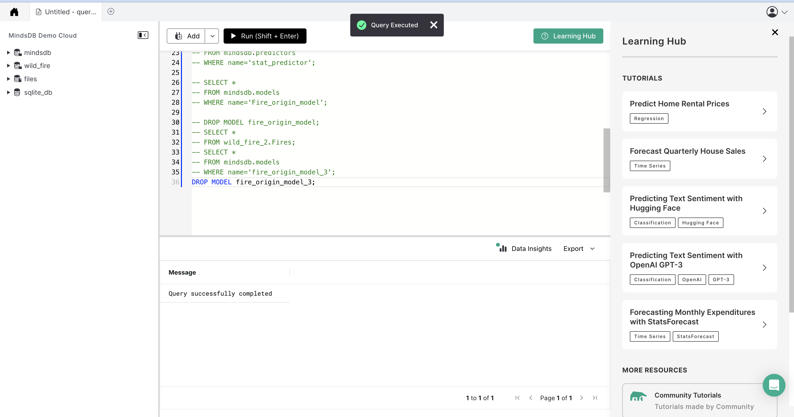

# Welcome to the MindsDB Manual QA Testing for SQLite Handler

> **Please submit your PR in the following format after the underline below `Results` section. Don't forget to add an underline after adding your changes i.e., at the end of your `Results` section.**

## Testing SQLite Handler with [Dataset Name](URL to the Dataset)

**1. Testing CREATE DATABASE**

```
CREATE DATABASE wild_fire      --- display name for database.
WITH ENGINE='sqlite',
PARAMETERS={
    "db_file": "mindsdb/integrations/handlers/sqlite_handler/FPA_FOD_20170508.db"               --- this points to the database file that the connection is to be made to
};
```



**2. Testing CREATE PREDICTOR**

```
CREATE MODEL 
  mindsdb.Fire_origin_model_3
FROM wild_fire
  (SELECT FIRE_YEAR,LATITUDE,LONGITUDE,DISCOVERY_DATE, STAT_CAUSE_DESCR FROM wild_fire.Fires LIMIT 100000)
PREDICT STAT_CAUSE_DESCR;
```



**3. Testing SELECT FROM PREDICTOR**

```
SELECT * 
FROM mindsdb.models
WHERE name='fire_origin_model_3';
```



### Results
```
SELECT * 
FROM mindsdb.models
WHERE name='fire_origin_model_3';
```


- [x] Works Great 💚 (This means that all the steps were executed successfuly and the expected outputs were returned.)
