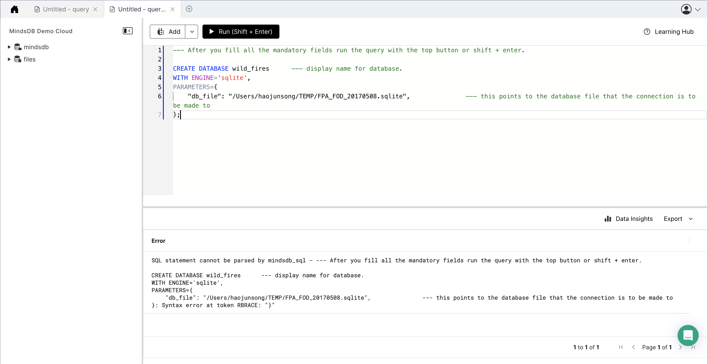

# Welcome to the MindsDB Manual QA Testing for SQLite Handler

> **Please submit your PR in the following format after the underline below `Results` section. Don't forget to add an underline after adding your changes i.e., at the end of your `Results` section.**

## Testing SQLite Handler with [Dataset Name](URL to the Dataset)

**1. Testing CREATE DATABASE**

```
CREATE DATABASE wild_fires      --- display name for database.
WITH ENGINE='sqlite',
PARAMETERS={
    "db_file": "/Users/haojunsong/TEMP/FPA_FOD_20170508.sqlite",               --- this points to the database file that the connection is to be made to
};
```


### Results

Drop a remark based on your observation.
- [ ] Works Great 💚 (This means that all the steps were executed successfuly and the expected outputs were returned.)
- [x] There's a Bug 🪲 [5412](https://github.com/mindsdb/mindsdb/issues/5412) ( This means you encountered a Bug. Please open an issue with all the relevant details with the Bug Issue Template)

---