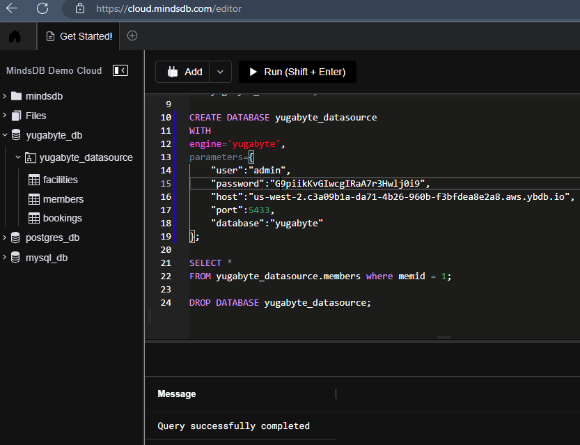
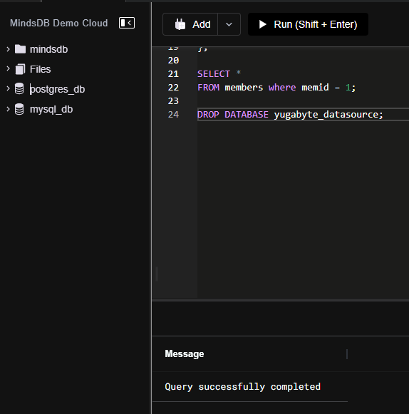

# Welcome to the MindsDB Manual QA Testing for Yugabyte Handler

### Results

---

## Testing Yugabyte Handler with [PG exercises](https://docs.yugabyte.com/preview/sample-data/pgexercises/)

**1. Testing CREATE DATABASE**

```
CREATE DATABASE yugabyte_datasource
WITH
engine='yugabyte',
parameters={
    "user":"admin",
    "password":"G9piikKvGIwcgIRaA7r3Hwlj0i9",
    "host":"us-west-2.c3a09b1a-da71-4b26-960b-f3bfdea8e2a8.aws.ybdb.io",
    "port":5433,
    "database":"yugabyte"
};
```
Note: I have changed the password



**2. Testing CREATE PREDICTOR**

```
COMMAND THAT YOU RAN TO CREATE PREDICTOR.
```


**3. Testing SELECT FROM PREDICTOR**

```
COMMAND THAT YOU RAN TO DO A SELECT FROM.
```


**4. Testing DROP THE DATABASE**

```
DROP DATABASE yugabyte_datasource;
```




- [x] There's a Bug 🪲 [[Bug]: Failed to fetch table from yugabytedb #6070](https://github.com/mindsdb/mindsdb/issues/6070) 

---