# MindsDB Agent Flow Diagram

## Overview
This diagram shows the complete flow of how the MindsDB agent processes a question and returns an answer.


## Key Components

### 1. **AgentsController** (`agents_controller.py`)
- Entry point for agent operations
- Handles CRUD operations for agents
- `get_completion()` method orchestrates the flow
- Combines default LLM config with agent-specific params

### 2. **PydanticAIAgent** (`pydantic_ai_agent.py`)
- Core agent implementation using Pydantic AI framework
- Manages LLM model instance
- Handles message conversion and history
- Orchestrates planning and execution loops

### 3. **Data Catalog Builder** (`data_catalog_builder.py`)
- Builds comprehensive data catalog of available tables and knowledge bases
- For each table: fetches sample data (5 rows) and metadata (column info)
- For each KB: fetches sample data (3 rows) and metadata
- Caches catalog entries for performance

### 4. **SQL Toolkit** (`sql_toolkit.py`)
- Executes SQL queries with permission checking
- Validates table/knowledge base access
- Handles query parsing and execution via MindsDB command executor
- Enforces read-only operations (SELECT, SHOW, DESCRIBE, etc.)

### 5. **Agent Modes** (`modes/`)
- **SQL Mode** (`sql.py`): Returns SQL queries only (final_query or exploratory_query)
- **Text-SQL Mode** (`text_sql.py`): Can return text responses, SQL queries, or both
- Both modes use structured `AgentResponse` with Pydantic models

## Flow Details

### Planning Phase
1. Agent receives question and message history
2. Builds data catalog of available data sources
3. Creates a planning agent with `PlanResponse` output type
4. LLM generates step-by-step execution plan
5. Plan includes estimated number of steps

### Execution Phase
1. Agent enters main loop with plan context
2. For each iteration:
   - Builds prompt with data catalog, SQL instructions, plan, and question
   - Includes previous exploratory query results if any
   - Includes error context if retrying
   - LLM generates `AgentResponse` with:
     - `sql_query`: The SQL to execute
     - `type`: final_query, exploratory_query, or final_text
     - `short_description`: Description of query purpose
3. Executes SQL query based on response type:
   - **FINAL_QUERY**: Execute and return results immediately
   - **EXPLORATORY_QUERY**: Execute, format results, add to context, continue loop
   - **FINAL_TEXT**: Return text response without SQL execution
4. Error handling with retry logic (up to MAX_RETRIES)
5. Maximum exploratory queries limit (MAX_EXPLORATORY_QUERIES = 20)

### Response Formatting
1. Validates select targets if specified (from original query)
2. Ensures all expected columns exist in result
3. Returns DataFrame with answer column
4. Includes trace_id for observability

## Configuration

- **MAX_EXPLORATORY_QUERIES**: 20 (maximum exploratory queries before forcing final)
- **MAX_RETRIES**: 3 (maximum retries per query on error)
- **System Prompt**: Configurable via agent params (`prompt_template`)
- **LLM Model**: Configurable via agent params or default_llm config
- **Data Sources**: Specified in agent params (`data.tables`, `data.knowledge_bases`)

## Observability

- Langfuse integration for tracing
- Trace includes metadata (user_id, session_id, company_id, model_name)
- Status updates streamed during execution
- Error tracking and reporting

## Simplified Text Flow

```
1. USER QUESTION
   ↓
2. AgentsController.get_completion()
   - Gets agent from database
   - Combines LLM params (default + agent-specific)
   ↓
3. Create PydanticAIAgent
   - Initialize LLM model instance
   - Initialize SQL toolkit (tables & knowledge bases)
   - Get system prompt
   ↓
4. Extract & Convert Messages
   - Extract current prompt (last user message)
   - Convert message history to Pydantic AI format
   ↓
5. Build Data Catalog
   - For each table: sample data (5 rows) + metadata
   - For each KB: sample data (3 rows) + metadata
   ↓
6. PLANNING PHASE
   - Create planning agent
   - Generate execution plan via LLM
   - Validate plan (max steps = 20)
   ↓
7. MAIN EXECUTION LOOP
   ↓
   a. Build Prompt
      - Data catalog
      - SQL instructions
      - Execution plan
      - Current question
      - Previous exploratory results (if any)
      - Error context (if retrying)
   ↓
   b. Run Agent → Get AgentResponse
      - sql_query: SQL to execute
      - type: final_query | exploratory_query | final_text
      - short_description: Query description
   ↓
   c. Handle Response Type:
      
      IF final_text:
         → Return text response to user
         → END
      
      IF final_query:
         → Execute SQL
         → IF error: retry (max 3 times)
         → IF success: Return results as DataFrame
         → END
      
      IF exploratory_query:
         → Execute SQL
         → IF error: retry or add to error context
         → IF success: Format results as markdown
         → Add to exploratory context
         → Increment exploratory count
         → IF count >= 20: Force final query next
         → Loop back to step 7a
   ↓
8. Validate & Format Response
   - Check select targets (if specified)
   - Ensure all expected columns exist
   - Return DataFrame with answer column
   ↓
9. RETURN TO USER
```

## Key Decision Points

1. **Planning vs Direct Execution**: Agent always creates a plan first to structure the approach
2. **Exploratory vs Final Queries**: Agent can explore data before generating final answer
3. **SQL vs Text Response**: Agent can return SQL results or text explanation
4. **Error Handling**: Retry logic (3 attempts) with error context accumulation
5. **Query Limits**: Maximum 20 exploratory queries to prevent infinite loops

---

# Simplified Flow Diagram

## Core Flow: Input → Processing → Catalog → Plan → Loop → Query Logic


## Simplified Stage Breakdown

### 1. **INPUT**
- User question/messages
- Can be: list of dicts (role/content), DataFrame, or legacy format

### 2. **INPUT PROCESSING**
- Extract current prompt (last user message)
- Convert message history to Pydantic AI format
- Initialize LLM model, SQL toolkit, system prompt

### 3. **REAL-TIME DATA CATALOG**
- **For Tables**: Query sample data (LIMIT 5) + metadata (SHOW COLUMNS)
- **For Knowledge Bases**: Query sample data (LIMIT 3) + schema info
- Built dynamically on each request (with caching)
- Provides context about available data sources

### 4. **PLAN**
- Planning agent generates execution plan
- Step-by-step approach to answer the question
- Estimates number of steps needed
- Validated against max exploratory queries (20)

### 5. **MAIN AGENT LOOP → KNOWLEDGE BUFFER**
- **Knowledge Buffer** accumulates:
  - Results from previous exploratory queries (formatted as markdown)
  - Error context from failed queries
  - Query descriptions and outcomes
- Buffer grows with each iteration
- Used to inform next query generation

### 6. **BUILD QUERY → TYPE OF QUERY LOGIC**

**Build Query:**
- Combines: Data Catalog + SQL Instructions + Plan + Question + Knowledge Buffer
- Sends to LLM agent
- Receives structured `AgentResponse`

**Query Type Logic:**

```
┌─────────────────────────────────────────┐
│         QUERY TYPE DECISION             │
└─────────────────────────────────────────┘
                    │
        ┌───────────┼───────────┐
        │           │           │
        ▼           ▼           ▼
   FINAL_TEXT  FINAL_QUERY  EXPLORATORY
        │           │           │
        │           │           │
   Return Text  Execute SQL  Execute SQL
   (No SQL)     Return Data  Add to Buffer
        │           │           │
        │           │           └───► Loop Back
        │           │
        └───────────┴───────────┐
                                │
                                ▼
                          OUTPUT
```

**FINAL_TEXT:**
- Agent determines answer can be given without SQL
- Returns text response immediately
- END

**FINAL_QUERY:**
- Agent generates final SQL query
- Executes query
- Returns results as DataFrame
- END

**EXPLORATORY_QUERY:**
- Agent needs to explore data first
- Executes SQL query
- Formats results as markdown table
- Adds to Knowledge Buffer
- Increments exploratory count
- Loops back to Main Agent Loop
- If count >= 20: Forces final query next iteration

## Key Concepts

### Knowledge Buffer
The knowledge buffer is a growing context that accumulates:
- **Exploratory Query Results**: Formatted as "Query: {sql}\nDescription: {desc}\nResult: {markdown_table}"
- **Error Context**: Failed queries with error messages (last 3 errors)
- **Query History**: All previous queries and their outcomes

This buffer allows the agent to:
- Learn from previous queries
- Avoid repeating failed queries
- Build upon discovered information
- Make informed decisions about next steps

### Real-Time Data Catalog
Built fresh on each request (with caching for performance):
- **Tables**: Sample rows + column metadata
- **Knowledge Bases**: Sample rows + schema information
- Provides LLM with current state of available data
- Enables accurate query generation

### Query Type Logic
The agent intelligently decides query type:
- **Exploratory**: When more information is needed
- **Final Query**: When ready to answer the question
- **Final Text**: When SQL is not needed

This decision happens at each iteration based on:
- Current question
- Knowledge buffer contents
- Data catalog information
- Execution plan

---

# Ultra-Simplified Flow

## Core Stages: Input Processing → Planning → Exploration Loop → Final Answer


## Ultra-Simplified Stage Description

### 1. **INPUT PROCESSING**
- Extract user question from messages
- Build real-time data catalog (tables + knowledge bases)
- Initialize LLM model and SQL toolkit
- Prepare system prompt

### 2. **PLANNING**
- Generate execution plan via planning agent
- Create step-by-step approach to answer question
- Estimate number of steps needed

### 3. **AGENT EXPLORATION LOOP**
```
LOOP:
  ├─ Generate Query (LLM creates SQL based on plan + context)
  ├─ Execute Query
  ├─ Check Query Type:
  │   ├─ EXPLORATORY → Add results to context → LOOP
  │   ├─ FINAL_QUERY → Exit loop → Final Answer
  │   └─ FINAL_TEXT → Exit loop → Final Answer
  └─ (Max 20 exploratory queries)
```

### 4. **FINAL ANSWER**
- Return results as DataFrame
- Format with expected columns
- Include trace_id for observability

## Flow Summary

```
INPUT (Question)
    ↓
INPUT PROCESSING
    • Extract prompt
    • Build data catalog
    • Initialize components
    ↓
PLANNING
    • Generate execution plan
    ↓
AGENT EXPLORATION LOOP
    • Generate query → Execute → Check type
    • If exploratory: Add to context → Loop
    • If final: Exit loop
    ↓
FINAL ANSWER
    • Return DataFrame
```

**Key Points:**
- **Input Processing**: Prepares everything needed (catalog, model, toolkit)
- **Planning**: Creates a structured approach before execution
- **Exploration Loop**: Iteratively explores data until ready to answer
- **Final Answer**: Returns formatted results to user

---

# Context Window Limitations & Missing RAG/Summarization

## Current Context Accumulation Points (No Limits/Compression)


## Context Window Bottlenecks

### 1. **Data Catalog** 🔴 **NO LIMITS**
**Location**: Built once, used in planning and main loop prompts

**Current Behavior:**
- Includes ALL tables and knowledge bases
- For each table: 5 sample rows + full column metadata
- For each KB: 3 sample rows + full schema info
- **No size limits**
- **No summarization**
- **No RAG/retrieval** - everything included regardless of relevance

**Potential Size:**
- 10 tables × (5 rows + metadata) = ~500-1000 tokens per table
- 5 KBs × (3 rows + schema) = ~300-500 tokens per KB
- **Total: 5,000-15,000+ tokens** (can be much larger)

**Where Used:**
- Planning prompt (line 436)
- Base prompt in main loop (line 468)
- **Included in EVERY LLM call**

**Missing Solutions:**
- ❌ No RAG to retrieve only relevant tables/KBs
- ❌ No summarization of catalog
- ❌ No size-based filtering
- ❌ No relevance scoring

---

### 2. **Message History** 🔴 **NO LIMITS**
**Location**: Passed to agent in main loop (line 505)

**Current Behavior:**
- Includes ALL previous messages in conversation
- **No truncation**
- **No summarization**
- **No compression**

**Potential Size:**
- Long conversations: 50+ messages × ~200 tokens = **10,000+ tokens**
- Can grow indefinitely

**Where Used:**
- Main loop agent call (line 503-505)
- **Included in EVERY iteration**

**Missing Solutions:**
- ❌ No message history summarization
- ❌ No sliding window truncation
- ❌ No compression of old messages
- ❌ No relevance-based filtering

---

### 3. **Exploration Loop Context** 🔴 **NO LIMITS**
**Location**: Accumulated in `exploratory_query_results` list (line 427, 490-492)

**Current Behavior:**
- Accumulates ALL exploratory query results
- Each result includes: SQL query + description + full markdown table
- **No size limits**
- **No summarization**
- **Grows with each iteration** (up to 20 queries)

**Potential Size:**
- 20 exploratory queries × (query + description + markdown table)
- Each markdown table: 100-500 rows × 10 columns = **2,000-10,000 tokens per result**
- **Total: 40,000-200,000+ tokens** (worst case)

**Where Used:**
- Added to prompt in every iteration (line 489-492)
- **Included in EVERY subsequent LLM call**

**Missing Solutions:**
- ❌ No summarization of query results
- ❌ No compression of markdown tables
- ❌ No size limits on accumulated results
- ❌ No selective retention (keep only relevant results)
- ❌ No RAG to retrieve only relevant past queries

---

### 4. **Base Prompt** 🔴 **NO LIMITS**
**Location**: Built once, used in every iteration (line 468)

**Current Behavior:**
- Includes FULL data catalog
- Includes FULL execution plan
- Includes SQL instructions
- Includes current question
- **No compression**

**Potential Size:**
- Data catalog: 5,000-15,000 tokens
- Plan: 500-1,000 tokens
- SQL instructions: 1,000-2,000 tokens
- Question: 100-500 tokens
- **Total: 6,600-18,500 tokens** (before adding exploratory results)

**Where Used:**
- Every iteration of main loop (line 488)

**Missing Solutions:**
- ❌ No compression of base prompt
- ❌ No dynamic catalog filtering
- ❌ No plan summarization

---

### 5. **Error Context** 🟡 **PARTIALLY LIMITED**
**Location**: Accumulated errors (line 426, 497-500, 553)

**Current Behavior:**
- Keeps last 3 errors only (line 553)
- ✅ **Has limit** (better than others)
- But still adds to context each iteration

**Potential Size:**
- 3 errors × ~500 tokens = **1,500 tokens**

---

## Total Context Window Usage (Worst Case)

```
Data Catalog:           15,000 tokens
Message History:         10,000 tokens
Base Prompt:             18,500 tokens
Exploratory Results:    200,000 tokens (20 queries × 10k each)
Error Context:            1,500 tokens
─────────────────────────────────────
TOTAL:                  245,000 tokens
```

**Typical Context Windows:**
- GPT-4: 128k tokens
- GPT-4 Turbo: 128k tokens
- Claude 3.5: 200k tokens
- **Risk: Exceeds context window in worst case**

---

## Missing RAG/Summarization Solutions

### Where RAG Could Help:

1. **Data Catalog RAG** 🔴 **NOT IMPLEMENTED**
   - Use semantic search to retrieve only relevant tables/KBs
   - Filter catalog based on question relevance
   - Reduce catalog from 15k → 2k tokens

2. **Message History Summarization** 🔴 **NOT IMPLEMENTED**
   - Summarize old messages (>10 messages ago)
   - Keep recent messages verbatim
   - Reduce history from 10k → 2k tokens

3. **Exploratory Results Summarization** 🔴 **NOT IMPLEMENTED**
   - Summarize query results instead of full markdown
   - Keep only key insights
   - Use RAG to retrieve relevant past queries
   - Reduce results from 200k → 10k tokens

4. **Dynamic Catalog Filtering** 🔴 **NOT IMPLEMENTED**
   - Filter catalog based on current question
   - Remove irrelevant tables/KBs
   - Use relevance scoring

5. **Plan Compression** 🔴 **NOT IMPLEMENTED**
   - Summarize plan after first few iterations
   - Keep only active steps

---

## Recommended Improvements

### Priority 1: Exploratory Results Compression
- **Impact**: High (can reduce 200k → 10k tokens)
- **Implementation**: Summarize markdown tables, keep only key insights
- **Location**: After each exploratory query execution (line 578-583)

### Priority 2: Data Catalog RAG
- **Impact**: High (can reduce 15k → 2k tokens)
- **Implementation**: Semantic search to retrieve relevant tables/KBs
- **Location**: Before building planning prompt (line 420)

### Priority 3: Message History Summarization
- **Impact**: Medium (can reduce 10k → 2k tokens)
- **Implementation**: Summarize messages older than N turns
- **Location**: Before passing to agent (line 505)

### Priority 4: Dynamic Base Prompt Compression
- **Impact**: Medium (can reduce 18k → 8k tokens)
- **Implementation**: Compress plan, filter catalog dynamically
- **Location**: Before building base prompt (line 468)

---

# Recommended Best Practices: Views & Catalog Limits

## Recommended Approach: Scoped Views + 10 Object Limit

```mermaid
flowchart TD
    Start([User Problem/Question]) --> AnalyzeScope[Analyze Problem Scope]
    
    AnalyzeScope --> CreateViews[CREATE VIEWS<br/>for Problem Scope]
    CreateViews --> View1[View 1: Filtered Data<br/>Only relevant columns<br/>Only relevant rows]
    CreateViews --> View2[View 2: Aggregated Data<br/>Pre-computed metrics<br/>Summary tables]
    CreateViews --> View3[View 3: Joined Data<br/>Pre-joined relationships<br/>Denormalized for query]
    
    View1 --> LimitCatalog[LIMIT CATALOG<br/>Max 10 Objects]
    View2 --> LimitCatalog
    View3 --> LimitCatalog
    
    LimitCatalog --> CountObjects{Object Count?}
    CountObjects -->|> 10| ReduceObjects[Reduce to 10 Objects<br/>✅ Prioritize views<br/>✅ Remove redundant tables<br/>✅ Keep only essential KBs]
    CountObjects -->|<= 10| ConfigureAgent[Configure Agent]
    ReduceObjects --> ConfigureAgent
    
    ConfigureAgent --> AgentConfig["Agent Configuration<br/>data.tables: view1, view2, view3<br/>data.knowledge_bases: kb1, kb2<br/>Total: ≤ 10 objects"]
    
    AgentConfig --> BuildCatalog[Build Data Catalog]
    BuildCatalog --> CatalogSize{Catalog Size}
    CatalogSize -->|Small| EfficientCatalog[Efficient Catalog<br/>✅ 10 objects max<br/>✅ Views = scoped data<br/>✅ ~2,000-5,000 tokens<br/>✅ Fits in context window]
    
    EfficientCatalog --> Planning[PLANNING]
    Planning --> EfficientPlan[Efficient Plan<br/>✅ Focused on scope<br/>✅ Fewer steps needed<br/>✅ Clearer context]
    
    EfficientPlan --> MainLoop[MAIN AGENT LOOP]
    MainLoop --> EfficientExecution[Efficient Execution<br/>✅ Smaller prompts<br/>✅ Faster responses<br/>✅ Lower costs]
    
    EfficientExecution --> Success([Success<br/>Within Context Limits])
    
    style CreateViews fill:#c8e6c9
    style LimitCatalog fill:#fff9c4
    style EfficientCatalog fill:#c8e6c9
    style EfficientPlan fill:#c8e6c9
    style EfficientExecution fill:#c8e6c9
    style Success fill:#4caf50,color:#fff
    style ReduceObjects fill:#fff3e0
```



## Best Practices: Views for Problem Scoping

### 1. **Create Scoped Views** ✅ **RECOMMENDED**

**Purpose**: Limit data to only what's relevant for the problem

**Example Workflow:**
```
Original Problem: "Analyze sales performance by region for Q4 2023"

❌ BAD: Give agent access to:
   - sales_raw (1M rows, 50 columns)
   - customers (500k rows, 30 columns)
   - products (10k rows, 20 columns)
   - orders (2M rows, 40 columns)
   - inventory, shipping, returns, etc.
   Total: 20+ tables, millions of rows

✅ GOOD: Create scoped views:
   CREATE VIEW sales_q4_2023 AS
   SELECT 
     region,
     SUM(amount) as total_sales,
     COUNT(*) as order_count,
     AVG(amount) as avg_order_value
   FROM sales_raw
   WHERE date >= '2023-10-01' 
     AND date < '2024-01-01'
   GROUP BY region;
   
   Then give agent access to:
   - sales_q4_2023 (pre-filtered, pre-aggregated)
   Total: 1 view, ~100 rows
```

**Benefits:**
- ✅ Reduces data catalog size dramatically
- ✅ Pre-filters irrelevant data
- ✅ Pre-aggregates for faster queries
- ✅ Clearer context for LLM
- ✅ Faster query execution

---

### 2. **Limit to 10 Objects Maximum** ✅ **RECOMMENDED**

**Rule**: Agent catalog should contain **≤ 10 objects** (tables + views + knowledge bases)

**Why 10?**
- Each object: ~500-1,000 tokens (sample data + metadata)
- 10 objects: ~5,000-10,000 tokens (manageable)
- Fits comfortably in context window
- Keeps agent focused on relevant data

**Object Counting:**
```
✅ GOOD Examples:

Example 1: Sales Analysis Agent
  - sales_summary_view (1)
  - sales_by_region_view (2)
  - sales_by_product_view (3)
  - sales_by_month_view (4)
  - products_kb (5)
  Total: 5 objects ✅

Example 2: Customer Support Agent
  - customer_tickets_view (1)
  - customer_history_view (2)
  - product_docs_kb (3)
  - faq_kb (4)
  Total: 4 objects ✅

Example 3: Financial Reporting Agent
  - revenue_summary_view (1)
  - expenses_summary_view (2)
  - budget_view (3)
  - financial_kb (4)
  Total: 4 objects ✅

❌ BAD Examples:

Example 1: Too Many Tables
  - table1, table2, table3, ..., table15
  Total: 15 objects ❌ (exceeds limit)

Example 2: Unscoped Access
  - sales_raw (1)
  - customers (2)
  - products (3)
  - orders (4)
  - inventory (5)
  - shipping (6)
  - returns (7)
  - payments (8)
  - reviews (9)
  - analytics (10)
  - logs (11)
  Total: 11 objects ❌ (exceeds limit)
```

---

## Recommended Agent Setup Pattern

### Step-by-Step Guide


### Example: Sales Analysis Agent Setup

```sql
-- Step 1-3: Create scoped views
CREATE VIEW sales_q4_summary AS
SELECT 
  region,
  product_category,
  SUM(amount) as total_sales,
  COUNT(DISTINCT customer_id) as unique_customers,
  AVG(amount) as avg_order_value
FROM sales_raw s
JOIN products p ON s.product_id = p.id
WHERE s.date >= '2023-10-01' AND s.date < '2024-01-01'
GROUP BY region, product_category;

CREATE VIEW top_customers_q4 AS
SELECT 
  customer_id,
  customer_name,
  SUM(amount) as total_spent,
  COUNT(*) as order_count
FROM sales_raw s
JOIN customers c ON s.customer_id = c.id
WHERE s.date >= '2023-10-01' AND s.date < '2024-01-01'
GROUP BY customer_id, customer_name
ORDER BY total_spent DESC
LIMIT 100;

-- Step 4-7: Configure agent (≤ 10 objects)
CREATE AGENT sales_analyst
USING 
  model_name = 'gpt-4',
  data = {
    'tables': ['sales_q4_summary', 'top_customers_q4'],
    'knowledge_bases': ['product_docs']
  };

-- Total: 3 objects ✅ (well under 10 limit)
```

---

## Context Size Comparison

### Without Best Practices ❌
```
Data Catalog:
  - 20 tables × 1,000 tokens = 20,000 tokens
  - 5 KBs × 500 tokens = 2,500 tokens
  Total: 22,500 tokens

Message History: 10,000 tokens
Base Prompt: 18,500 tokens
Exploratory Results: 50,000 tokens
─────────────────────────────────
TOTAL: 101,000 tokens
⚠️ Risk of exceeding context window
```

### With Best Practices ✅
```
Data Catalog:
  - 8 views × 600 tokens = 4,800 tokens
  - 2 KBs × 400 tokens = 800 tokens
  Total: 5,600 tokens (75% reduction)

Message History: 10,000 tokens
Base Prompt: 8,000 tokens (smaller catalog)
Exploratory Results: 15,000 tokens (fewer queries needed)
─────────────────────────────────
TOTAL: 38,600 tokens
✅ Well within context window
✅ Faster responses
✅ Lower costs
```

---

## Key Recommendations Summary

### ✅ DO:
1. **Create views** to scope data to problem domain
2. **Limit to 10 objects** maximum in agent catalog
3. **Pre-filter and pre-aggregate** data in views
4. **Use views instead of raw tables** when possible
5. **Combine related data** into single views
6. **Test catalog size** before deploying agent

### ❌ DON'T:
1. **Don't give agent access to all tables** in database
2. **Don't exceed 10 objects** in catalog
3. **Don't use raw tables** when views would work
4. **Don't include redundant data** (multiple tables with same info)
5. **Don't skip scoping** - always create problem-specific views

---

## Benefits of This Approach

1. **Context Window Management** ✅
   - Keeps total context under 50k tokens
   - Fits comfortably in all modern LLM context windows
   - Reduces risk of truncation

2. **Performance** ✅
   - Faster query execution (pre-aggregated views)
   - Faster LLM responses (smaller prompts)
   - Lower token costs

3. **Accuracy** ✅
   - Agent focuses on relevant data
   - Less confusion from irrelevant tables
   - Clearer context for better queries

4. **Maintainability** ✅
   - Views document data scope
   - Easy to update when problem changes
   - Clear separation of concerns

